# 3D Asset Forge

Plataforma profesional en JavaScript para crear, importar, validar, articular y exportar objetos 3D preparados para motores en tiempo real.


## Objetivo

3D Asset Forge es un entorno de trabajo 3D centrado en la preparacion practica de assets. La plataforma combina generacion procedural, importacion de modelos, ajuste inteligente de escala, deteccion de articulaciones, validacion de movimientos y exportacion GLB en un unico flujo.

El objetivo principal es reducir el trabajo manual necesario para preparar modelos 3D descargados, mecanicos, roboticos, vehiculares o de simulacion. La plataforma busca detectar pivotes, ejes y articulaciones, permitir validar como debe moverse cada pieza y guardar ese aprendizaje para futuras demos o exportaciones.

## Capacidades Actuales

- Generadores procedurales de objetos hard-surface listos para prototipos.
- Importacion directa de `.glb`, `.fbx`, `.dae`, `.obj` y `.3ds`.
- Mensajes claros para formatos propietarios que requieren conversion previa: `.blend`, `.c4d`, `.max`, `.sldprt` y `.sldasm`.
- Ajuste inteligente de escala para modelos demasiado grandes o desplazados.
- Deteccion de articulaciones a partir de nombres, pivotes, huesos y jerarquias importadas.
- Reconstruccion mecanica para modelos `.3ds` donde los pivotes y las mallas visibles llegan como objetos planos.
- Controles logicos por articulacion: `Rotate X/Y/Z` o `Slide X/Y/Z`.
- Motion Trainer para validar movimientos test por test.
- Demo aprendida basada solo en movimientos validados y ordenados por el usuario.
- Warehouse de piezas con dashboard separado, categorias, clases y miniaturas reales.
- Guardado fisico de piezas y conjuntos como `.glb` dentro de `project-warehouse/<projectId>/`.
- Guardado permanente de cambios del workspace: color, transformaciones, copias y objetos importados.
- Borrado permanente desde workspace o warehouse, eliminando tambien el fichero local asociado.
- Componentes funcionales persistentes con interfaces mecanicas, propiedades, subgrafo cinematico y validacion de assemblies.
- Soporte para rigs profesionales de celda robotica: cobot 6 ejes, brazo industrial 6 ejes con pinza y cinta transportadora parametrica.
- Celda industrial real desde `scenario_1`: robot gantry, cintas, maquina de inspeccion, operador y cajas cargados como GLB reales.
- Ciclo de celda sincronizado con captura por contacto: el brazo solo levanta una caja si la pinza toca una caja suelta colocada manualmente.
- Kinematic Authoring M1 para corregir joints, ejes arbitrarios, origen fisico, limites, estado home y validacion del grafo cinematico.
- Calibracion de piezas aisladas: centro de referencia calculado desde la malla, correccion manual persistente y prueba visual sobre ese pivot.
- Preflight de exportacion y perfiles GLB para uso generico, Unity, Unreal y Godot.
- Modo navegador y base Tauri para aplicacion de escritorio.

## Plataforma En Accion

### Modelo Articulado Importado

La plataforma normaliza modelos grandes, detecta articulaciones mecanicas y muestra controles especificos en el inspector.


### Motion Trainer

Motion Trainer lanza pruebas de movimiento una por una. El usuario valida o rechaza cada movimiento candidato para ensenar a la plataforma como debe moverse ese modelo concreto.

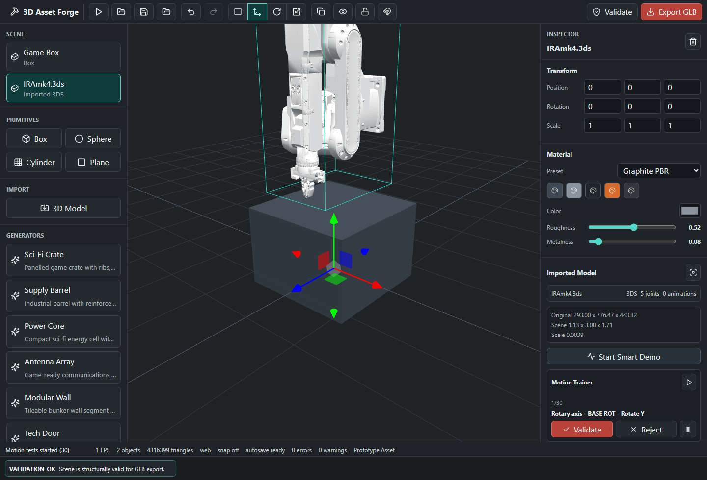

### Secuencia De Movimiento Aprendida

Los movimientos validados se guardan, se muestran en una lista y se pueden ordenar. La demo automatica usa esa secuencia aprendida en lugar de aplicar movimientos genericos.

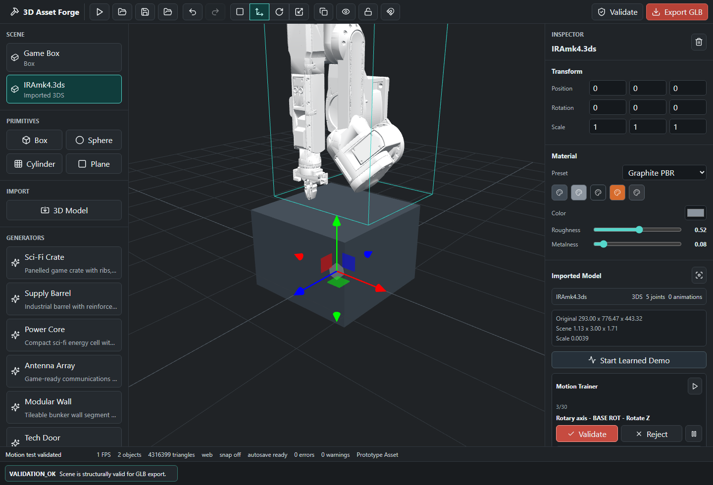

### Desmantelado En Piezas

Un modelo robotico importado puede separarse en piezas reutilizables. Cada pieza queda clasificada por categoria y clase dentro del warehouse, con miniatura real generada desde la escena.


### Reconstruccion En Workspace

Las piezas guardadas pueden volver al escenario como objetos independientes. Esto permite reconstruir conjuntos, modificar piezas sueltas, crear variantes y guardar nuevas versiones.

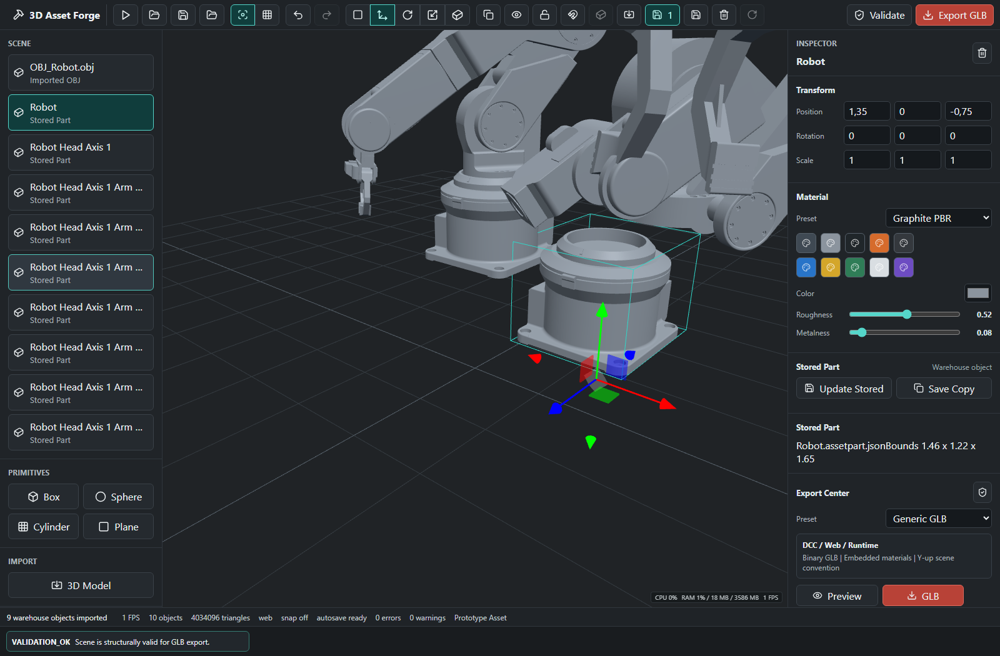

### Modelo Robotico Importado

El flujo empieza con modelos reales importados, no con placeholders. La plataforma mantiene la visualizacion del asset completo mientras permite extraer piezas y convertirlas en componentes reutilizables.

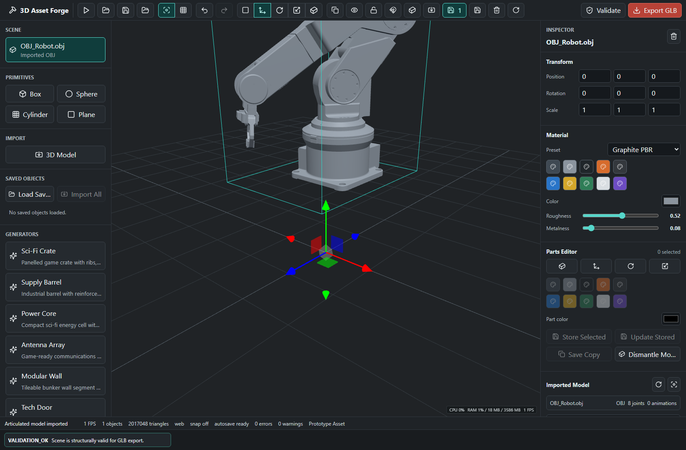

## Casos De Uso Y Valor

3D Asset Forge esta pensada para convertir modelos 3D complejos en una libreria reutilizable de componentes. Esto reduce tiempo de preparacion, evita rehacer piezas y permite crear variantes comerciales a partir de assets existentes.

Casos de uso principales:

- Preparacion de catalogos 3D: desmontar modelos de vehiculos, brazos roboticos, maquinaria o productos y guardar piezas independientes con miniaturas.
- Reutilizacion de componentes: extraer bases, articulaciones, ruedas, paneles, brazos o pinzas para crear nuevos conjuntos sin volver al modelo original.
- Prototipado industrial: importar piezas guardadas al workspace, combinarlas y guardar conjuntos como assemblies reutilizables.
- Variantes de producto: cambiar color, escala o posicion de una pieza y guardarla como nuevo GLB permanente.
- Control de inventario visual: revisar categorias, clases, codigos, peso del warehouse y previews antes de importar una pieza.
- Pipeline comercial: preparar assets limpios para GLB, Unity, Unreal, Godot, web viewers, configuradores y demos de producto.


## Como Funciona

Manual operativo separado:

- [Manual de uso: warehouse, piezas y workspace](docs/manual-uso-warehouse.md)

### 1. Crear O Importar

El usuario puede crear objetos procedurales desde el panel de generadores o importar un modelo existente. El modelo importado queda embebido dentro del documento del proyecto como data URL, por lo que puede guardarse y restaurarse sin depender de rutas externas.

Formatos soportados directamente:

| Formato | Extension | Notas |
| --- | --- | --- |
| glTF Binary | `.glb` | Formato recomendado para intercambio moderno |
| FBX | `.fbx` | Comun en pipelines de animacion y videojuegos |
| Collada | `.dae` | Util en flujos DCC antiguos |
| OBJ | `.obj` | Importacion de mallas estaticas |
| 3DS | `.3ds` | Soportado con reconstruccion de jerarquia mecanica |

Para robots y maquinaria articulada, `.glb` es la opcion preferida cuando existe. Un `.obj` normalmente solo trae malla y material basico; no guarda una escena mecanica moderna con jerarquia, nodos funcionales, clips, pivotes o metadatos de rig. Por eso algunos modelos `.obj` se ven bien como geometria estatica pero no se mueven correctamente hasta que la plataforma reconstruye un rig externo. En cambio, `.glb` puede conservar nodos, transforms, materiales PBR y datos de animacion en un unico fichero. En `IRAmk4`, la alternativa valida es `.3ds`, porque contiene una separacion de objetos que permite recuperar mejor la estructura mecanica que el OBJ plano.

### 2. Normalizar Escala

Muchos modelos descargados o exportados desde CAD llegan con escalas enormes, muy pequenas o desplazados del suelo. El importador calcula limites originales, limites normalizados, escala de importacion y offset. El resultado queda ajustado a una escena practica sin destruir los datos originales.

### 3. Detectar Articulaciones

La plataforma analiza objetos, huesos y nombres para inferir comportamiento mecanico:

- ruedas y neumaticos se convierten en controles rotativos;
- puertas y paneles se tratan como bisagras;
- brazos, munecas, cabezales y ejes se tratan como articulaciones rotativas;
- railes, pistones y piezas telescopicas se tratan como desplazamientos lineales;
- huesos de esqueleto se tratan como articulaciones de rig.

En modelos `.3ds` como `IRAmk4.3ds`, la plataforma reconstruye una jerarquia mecanica agrupando mallas visibles bajo pivotes detectados como `BASE_ROT`, `ARM_1`, `ARM_2`, `HEAD_ST` y `HEAD_ND`.

### 4. Controlar Movimiento De Forma Logica

El inspector muestra un unico control logico por articulacion. Una base rotatoria usa `Rotate Y`; un actuador lineal usa `Slide X/Y/Z`; una rueda usa un eje rotativo. Esto evita movimientos sin sentido, como desplazar verticalmente una pieza que realmente debe rotar.

### 5. Entrenar Movimiento Especifico Del Modelo

Motion Trainer genera candidatos para cada articulacion detectada. El flujo es:

1. Pulsar `Start Tests`.
2. Observar el movimiento candidato actual.
3. Pulsar `Validate` si el movimiento es correcto.
4. Pulsar `Reject` si no tiene sentido.
5. Repetir hasta construir el mapa de movimiento del modelo.
6. Ordenar los movimientos validados con las flechas.
7. Pulsar `Start Learned Demo` para reproducir la secuencia aprendida.

Los datos aprendidos se guardan en el documento como `validatedMotions`, incluyendo articulacion, tipo de movimiento, eje, limites, amplitud y orden.

### 6. Guardar Piezas En Warehouse

El warehouse permite convertir piezas desmontadas o conjuntos creados en el escenario en objetos 3D independientes. Las piezas permanentes se guardan como `.glb` fisicos en el proyecto local y se indexan en `manifest.json`.

Flujo principal:

1. Importar un modelo con `3D Model`.
2. Pulsar `Dismantle selected model into warehouse`.
3. Abrir `Warehouse dashboard`.
4. Pulsar `Save All`.
5. Refrescar la pagina.
6. Pulsar `Load Saved`.
7. Importar una pieza con `Import saved warehouse object to workspace`.

Si se modifica una pieza en el workspace, el boton `Save workspace changes permanently` se activa y guarda fisicamente esos cambios. Las miniaturas del warehouse se guardan tambien en el manifest para que despues del refresh no aparezca el icono generico.

Los detalles completos estan en:

- [Manual de uso: warehouse, piezas y workspace](docs/manual-uso-warehouse.md)

### 7. Base Mecanica Funcional

Las piezas reutilizables ya no se tratan solo como geometria. Cada pieza almacenada puede llevar un `FunctionalComponent` con:

- geometria y material;
- transformacion local, origen y limites;
- propiedades mecanicas inferidas;
- interfaces mecanicas como ejes, bisagras, mounts, shafts, rails, supports o grippers;
- subgrafo `KinematicGraph` asociado a la pieza original.

Cuando se guarda un conjunto, la plataforma crea un `FunctionalAssembly` persistente. El assembly conserva componentes, conexiones sugeridas, joints, limites, jerarquia y un `KinematicGraph` reconstruido del conjunto.

El validador de assemblies detecta componentes flotantes, conexiones incompatibles, limites contradictorios, referencias rotas, duplicados y ciclos cinematicos antes de considerar valido el conjunto.

### 8. Kinematic Authoring M1

El inspector del modelo importado incluye `Kinematic Authoring`, una capa no destructiva basada en `KinematicGraph V2`. Su objetivo es reconstruir o corregir una maquina como una cadena real:

```text
Rigid Part / Link -> Joint -> Rigid Part / Link
```

Funciones actuales:

- crear un joint candidato desde dos piezas seleccionadas en modo `Parts`;
- editar `Parent`, `Child`, `Type`, `Axis`, `Origin` y limites;
- usar atajos de eje `X`, `Y`, `Z` o escribir un eje arbitrario como `[0.707, 0.707, 0]`;
- seleccionar el `Joint Origin` directamente sobre el modelo en el viewport;
- editar visualmente el eje con un gizmo 3D;
- definir un eje con `Two-Point Axis`, seleccionando A y B sobre el modelo;
- ver pivot, frame local y eje activo como helpers de escena no destructivos;
- definir coupling/mimic entre joints con `driverJointId`, `multiplier` y `offset`, por ejemplo dos dedos de gripper con movimiento opuesto;
- probar el joint con un slider sin reimportar ni reconstruir el modelo;
- aceptar, rechazar, borrar o resetear el joint;
- volver a `Home` para recuperar la configuracion cero;
- validar raiz, referencias, ejes, origen, limites, ciclos, duplicados y piezas huerfanas.

La definicion estructural queda en `kinematicGraph`; la pose de prueba queda separada en `kinematicState`. Esto evita acumular errores y permite guardar/recuperar el mecanismo sin convertir la geometria original en un asset destructivo.

### 9. Calibracion De Piezas Desmontadas

Una pieza desmontada no hereda los movimientos del modelo completo. Al abrir `Analyze piece`, la plataforma crea una definicion limpia y realiza este flujo antes de permitir que se guarde como componente funcional:

```text
Pieza aislada
  -> centro de referencia geometrico
  -> pivot y ejes locales visibles
  -> tipo de movimiento y eje elegidos
  -> prueba de movimiento acotada
  -> validacion y persistencia en Warehouse
```

El centro se calcula directamente sobre los triangulos reales de la malla, en coordenadas locales de la pieza:

1. Centroide de volumen mediante tetraedros con densidad uniforme, cuando la malla forma un solido cerrado.
2. Centroide ponderado por area, cuando el modelo es una superficie abierta o tiene winding inconsistente.
3. Centro de bounds como respaldo seguro para assets sin triangulos validos.
4. Correccion manual con `Correct reference center`: el clic sustituye la estimacion y se guarda como `manual`.

La referencia se persiste como `pieceReferenceCenter` con posicion, metodo, confianza, numero de triangulos y fecha. Tambien se copia al `FunctionalComponent`, al pivot del joint y al objeto independiente almacenado. Al serializar una pieza para Warehouse, sus puntos y ejes se convierten al espacio de coordenadas del nuevo asset; asi el pivot no queda desplazado al volver a cargarla.

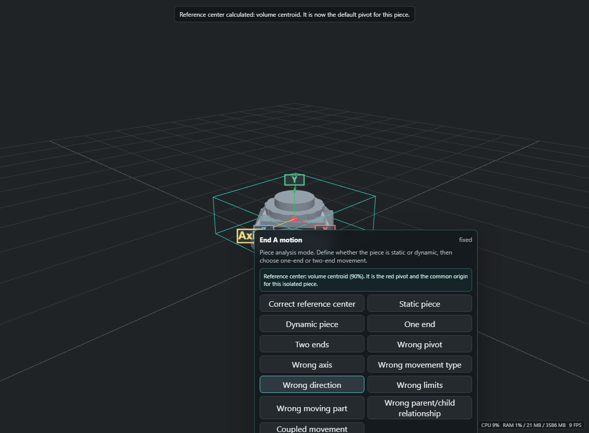

La pieza no se mueve durante el calculo. Despues se selecciona el comportamiento mecanico: estatica, rotacion pura alrededor del pivot, traslacion pura sobre un eje, o movimiento entre dos extremos. Las pruebas siempre arrancan desde `Home`, respetan limites y vuelven a `Home` al terminar. Una rotacion no introduce traslacion adicional; una traslacion se proyecta exclusivamente sobre su eje configurado.

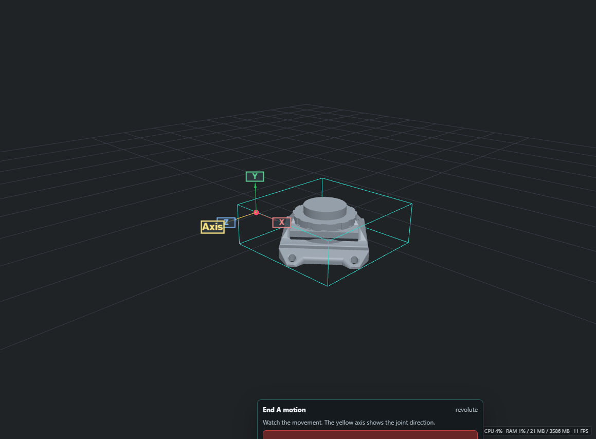

### Celda Robotica Profesional

Los activos de `3d imported models/celda_robotica/` se integran con su contrato mecanico documentado. La plataforma lee los metadatos `robot-arm-rig/1.1` y `conveyor-rig/1.0`, conserva la geometria original y aplica un solo valor local por articulacion. Los hijos siguen al padre por jerarquia; las mallas no se reparentan ni se animan como piezas sueltas.

**Cobot colaborativo 6 ejes**

J1 gira sobre Y, J2-J4 sobre Z, J5 sobre X y J6 sobre Y. Los clips importados son `Ciclo_Asistencia`, `Guiado_Manual` y `Demo_Ejes`.

Vista frontal:

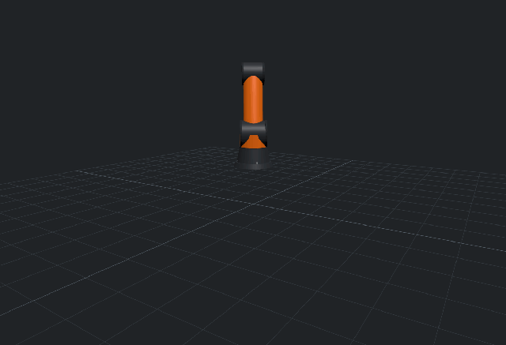

Vista lateral:

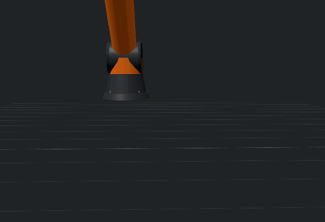

Vista superior:

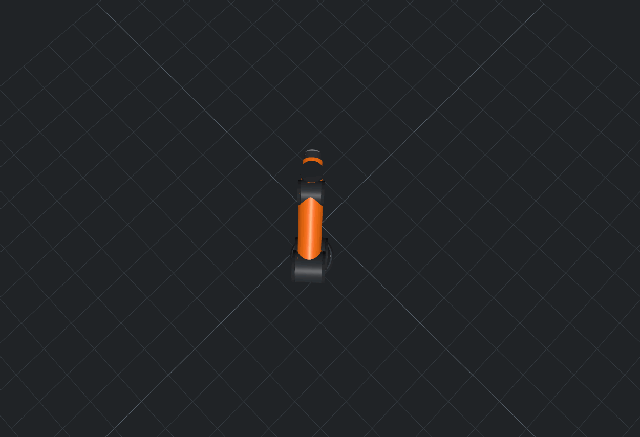

**Brazo industrial 6 ejes con pinza**

El modelo estatico `industrial-arm-6dof.obj` se puede recuperar desde la documentacion de la celda: J1 Y, J2 Z, J3 Z, J4 Y, J5 Z, J6 Y y dos dedos lineales opuestos en X. La pinza usa coupling/mimic para que los dedos se muevan de forma simetrica. Para la demo visual del README se usa `industrial-arm-6dof.glb`, porque conserva mejor la escena, los materiales y la estructura funcional.

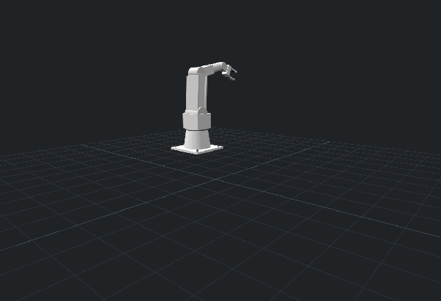

**Cinta transportadora parametrica**

La cinta no depende de keyframes de malla. El valor del rodillo calcula distancia recorrida, desplaza la textura de la banda, rota R1/R2 sobre Z, mueve las piezas opcionales sobre +X y acciona el tope S1 sobre Y.

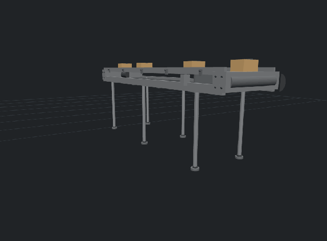

### Celda Industrial Real Scenario 1

La plataforma incluye una variante real de la celda industrial en `3d imported models/scenario_1/`. A diferencia del pack procedural `Industrial Cell`, el boton `Real Cell` carga GLB reales:

- `gantry-robot.glb`
- `conveyor-segment.glb`
- `inspection-machine.glb`
- `operator.glb`
- `cargo-box.glb`

Estos assets conservan la jerarquia funcional necesaria para el movimiento:

- `G1_column_yaw`, `G2_boom_extend`, `G3_head_lift`, `G4_head_roll` y `G5_finger_*` para el robot gantry.
- `R1_drive_roller`, `R2_idler_roller`, `S1_stopper` y `BELT_surface` para las cintas.
- `M3_door_hinge`, `M4_fan` y `M6_curtain_*` para la maquina de inspeccion.
- `O1_hips_yaw`, `O2_spine_pitch`, `O4_head_yaw`, `O6_shoulder_R`, `O7_elbow_R` y equivalentes izquierdos para el operador.
- `L1_lid_hinge` para la caja.

El flujo real es:

1. Pulsar `Real Cell`.
2. Seleccionar una `Loose Box`.
3. Moverla manualmente en el escenario con el modo axial.
4. Acercarla al recorrido de la pinza.
5. Pulsar `Cell Cycle`.
6. Si la pinza toca la caja, el brazo la levanta y la deja sobre la cinta.
7. Si no hay contacto, el brazo ejecuta el ciclo vacio y no teletransporta ninguna caja.

La celda real reutiliza el mismo `KinematicGraph` que la celda procedural, pero la geometria visible sale de los GLB de `scenario_1`. Esto permite comparar el prototipo JS contra assets reales sin duplicar la logica mecanica.

La geometria por si sola no puede demostrar la funcion fisica real de una pieza sin sus conexiones, contactos o especificacion mecanica. Por eso la plataforma automatiza el calculo y las invariantes geometricas, pero deja al usuario validar la funcion mecanica observada antes de aceptarla. Esta separacion evita inventar articulaciones falsas.

### Persistencia De M1

M1 separa tres responsabilidades:

- `kinematicGraph`: definicion mecanica persistente, con joints, parent/child, origins, axes, limits, status, evidence y mimic.
- `kinematicState`: estado de pose/home persistente o restaurable, sin reescribir la definicion.
- asset 3D pesado: geometria original o referencia al asset persistente correspondiente.

En navegador, los modelos grandes no deben depender de duplicarse dentro de `localStorage`. La definicion cinemática puede persistirse como proyecto compacto y el asset debe recuperarse desde el mecanismo persistente disponible, como Warehouse/storage fisico o referencia de proyecto. El estado visual temporal de la UI no forma parte de la definicion mecanica.

## Estrategia De Rendimiento

La plataforma esta optimizada para evitar recargas innecesarias:

- los modelos importados se cachean despues del parseo;
- la geometria pesada no se reconstruye cuando solo cambia una pose;
- los sliders manuales aplican transformaciones directamente sobre objetos Three.js ya cargados;
- la demo automatica corre dentro del render loop;
- cambios de seleccion, herramienta o snap no fuerzan una reconstruccion completa;
- se guardan rotaciones y posiciones base para aplicar cada movimiento desde un estado estable.

Esto es clave para modelos densos como `IRAmk4.3ds`, que contiene millones de triangulos.

## Estructura Del Proyecto

```text
src/
  application/          Perfiles, validacion, cinematica, flujos de proyecto y modelo mecanico funcional
  domain/               Tipos principales, kinematics, mechanics, factories y generadores
  infrastructure/       Importadores, escena Three.js, exportacion GLB y storage
  presentation/         UI React, inspector, viewport y controles del editor
src-tauri/              Base para aplicacion de escritorio
docs/readme-assets/     Capturas y animaciones usadas por este README
3d imported models/     Modelos reales usados para pruebas, rigs y celdas industriales
project-warehouse/      Almacen local de piezas GLB permanentes en desarrollo
```

## Lanzar El Proyecto

Instalar dependencias:

```bash
npm install
```

En Windows PowerShell, si `npm` queda bloqueado por `npm.ps1`, usar:

```powershell
npm.cmd install
```

Arrancar el servidor de desarrollo:

```bash
npm run dev -- --port 5187 --strictPort
```

En Windows PowerShell:

```powershell
npm.cmd run dev -- --port 5187 --strictPort
```

Copiar solo el comando, no el prefijo del terminal. Por ejemplo, no copiar `PS C:\...\3D Asset Platform>`.

Si el puerto esta ocupado por una instancia anterior de la misma plataforma, usar:

```powershell
npm.cmd run dev:fresh -- --port 5187
```

Este comando cierra el servidor Vite anterior del proyecto y lo vuelve a abrir en el mismo puerto.

Abrir en el navegador:

```text
http://127.0.0.1:5187
```

Construir version de produccion:

```bash
npm run build
```

En Windows PowerShell:

```powershell
npm.cmd run build
```

Previsualizar la build:

```bash
npm run preview
```

## Modo Escritorio

El proyecto incluye una base Tauri para empaquetado de escritorio:

```bash
npm run desktop:dev
npm run desktop:build
```

La version de escritorio requiere tener instalado Rust/Tauri. El flujo en navegador funciona sin Rust.

## Assets Del README

Todas las imagenes y animaciones del README estan en:

```text
docs/readme-assets/
```

Assets actuales:

- `platform-overview.png`
- `imported-iramk4-inspector.png`
- `imported-iramk4-viewport.png`
- `motion-trainer-test.png`
- `learned-motion-sequence.png`
- `piece-reference-center.png` (evidencia Playwright del centro calculado)
- `piece-rotation-test.png` (evidencia Playwright de la prueba de rotacion)
- `cell-cobot-front-motion.gif` (cobot 6 ejes, vista frontal, clip `Ciclo_Asistencia`)
- `cell-cobot-side-motion.gif` (cobot 6 ejes, vista lateral, clip `Ciclo_Asistencia`)
- `cell-cobot-top-motion.gif` (cobot 6 ejes, vista superior, clip `Ciclo_Asistencia`)
- `cell-industrial-arm-motion.gif` (brazo industrial con clip `Toma_De_Cinta`)
- `cell-conveyor-motion.gif` (cinta parametrica con clip `Ciclo_Transporte`)
- `arm-motion-industrial.gif` (animacion completa del brazo industrial)
- `robot-arm-full-motion.gif` (animacion completa del brazo industrial)

## Estado De Validacion

Comandos principales de validacion:

```bash
npm run build
npm run test:kinematics
npm run test:kinematics:e2e
npm run test:articulation
npm run test:render
npm run test:parts
npm run test:piece-mode
npm run test:cell-rigs
npm run test:industrial-scene
npm run test:all
```

`test:kinematics` cubre K01-K30: normalizacion de ejes, ejes invalidos, eje arbitrario, pivote correcto, revolute, continuous, prismatic, fixed, limites, propagacion padre-hijo, cadenas con incoming/outgoing joint, ciclos, huerfanos, IDs duplicados, NaN/Infinity, two-point axis, origin picking, mimic/coupling, logical controls, home sin drift, no destructivo, rejected joints, quaternion normalizado, multiples padres y rendimiento sintetico.

`test:kinematics:e2e` usa Playwright con un modelo robotico real para validar creacion manual de joint, picking visual, helpers de pivot/eje, mimic, guardado, reload, migracion legacy y proteccion no destructiva del asset fuente.

`test:piece-mode` usa `Rmk3.obj` y comprueba el flujo completo de una pieza desmontada: entrada desde un joint, calculo de centro desde la malla, correccion manual, coincidencia exacta entre centro y pivot, rotacion Z durante una prueba real, salida de modo pieza y persistencia del centro dentro del componente de Warehouse.

`test:cell-rigs` importa `cobot-6dof.glb`, `industrial-arm-6dof.obj` y `conveyor-belt-2400.glb`; comprueba joints, ejes locales, clips, coupling de pinza, aplicacion de movimiento y render visible despues de mover cada activo.

`test:industrial-scene` valida dos flujos: la celda procedural `Industrial Cell` y la celda real `Real Cell` basada en GLB de `scenario_1`. Comprueba render visible, joints, ciclo sincronizado, varias cajas sueltas en suelo, ausencia de captura falsa sin contacto y captura/liberacion correcta cuando una caja se coloca en la pinza.

Para regenerar las capturas del README desde esta prueba en Windows PowerShell:

```powershell
$env:PIECE_MODE_CAPTURE_DIR='docs/readme-assets'; npm.cmd run test:piece-mode
```

Para regenerar una animacion de una pieza:

```powershell
npm.cmd run docs:capture:piece-motion
```

Para generar las demostraciones mecanicas del README:

```powershell
$env:ARM_MODEL_PATH='3d imported models\nuewrobot\brazo-robot-industrial\industrial-arm-6dof.glb'; $env:ARM_GIF_OUTPUT='docs\readme-assets\arm-motion-industrial.gif'; $env:ARM_GIF_LABEL='Brazo industrial GLB'; npm.cmd run docs:capture:arm-model
```

Para generar las demostraciones de la celda robotica:

```powershell
$env:ARM_MODEL_PATH='3d imported models\celda_robotica\cobot-6dof.glb'; $env:ARM_GIF_OUTPUT='docs\readme-assets\cell-cobot-front-motion.gif'; $env:ARM_GIF_LABEL='Cobot frontal GLB'; $env:ARM_CLIP_NAME='Ciclo_Asistencia'; $env:ARM_GIF_MIN_CHANGED='35'; $env:ARM_GIF_CAMERA='{"position":[4.2,2.3,5.8],"target":[0,1.05,0]}'; npm.cmd run docs:capture:arm-model
$env:ARM_MODEL_PATH='3d imported models\celda_robotica\cobot-6dof.glb'; $env:ARM_GIF_OUTPUT='docs\readme-assets\cell-cobot-side-motion.gif'; $env:ARM_GIF_LABEL='Cobot lateral GLB'; $env:ARM_CLIP_NAME='Ciclo_Asistencia'; $env:ARM_GIF_MIN_CHANGED='35'; $env:ARM_GIF_CAMERA='{"position":[6.4,2.1,0.15],"target":[0,1.05,0]}'; npm.cmd run docs:capture:arm-model
$env:ARM_MODEL_PATH='3d imported models\celda_robotica\cobot-6dof.glb'; $env:ARM_GIF_OUTPUT='docs\readme-assets\cell-cobot-top-motion.gif'; $env:ARM_GIF_LABEL='Cobot superior GLB'; $env:ARM_CLIP_NAME='Ciclo_Asistencia'; $env:ARM_GIF_MIN_CHANGED='35'; $env:ARM_GIF_CAMERA='{"position":[0.35,7.2,0.35],"target":[0,1.05,0]}'; npm.cmd run docs:capture:arm-model
$env:ARM_MODEL_PATH='3d imported models\celda_robotica\industrial-arm-6dof.glb'; $env:ARM_GIF_OUTPUT='docs\readme-assets\cell-industrial-arm-motion.gif'; $env:ARM_GIF_LABEL='Brazo industrial celda GLB'; $env:ARM_CLIP_NAME='Toma_De_Cinta'; $env:ARM_GIF_MIN_CHANGED='35'; npm.cmd run docs:capture:arm-model
$env:ARM_MODEL_PATH='3d imported models\celda_robotica\conveyor-belt-2400.glb'; $env:ARM_GIF_OUTPUT='docs\readme-assets\cell-conveyor-motion.gif'; $env:ARM_GIF_LABEL='Cinta celda'; $env:ARM_CLIP_NAME='Ciclo_Transporte'; $env:ARM_GIF_MIN_CHANGED='35'; $env:ARM_GIF_CAMERA='{"position":[2.6,1.35,1.65],"target":[0,0.72,0]}'; npm.cmd run docs:capture:arm-model
```

El aviso de bundle grande es esperado porque la aplicacion incluye Three.js y varios loaders 3D. No bloquea la build de produccion.
