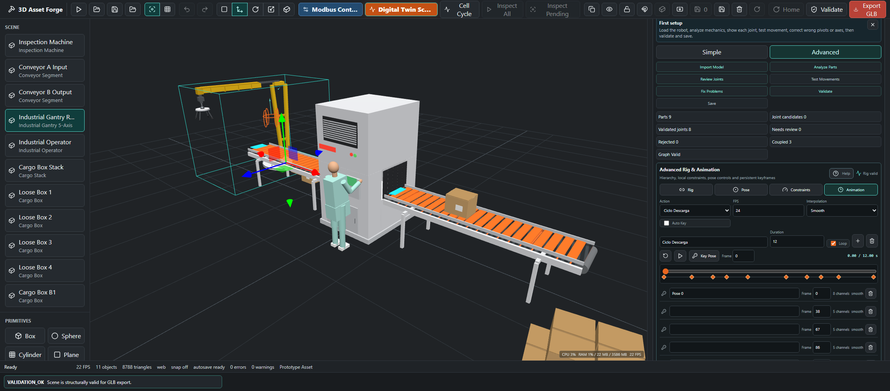
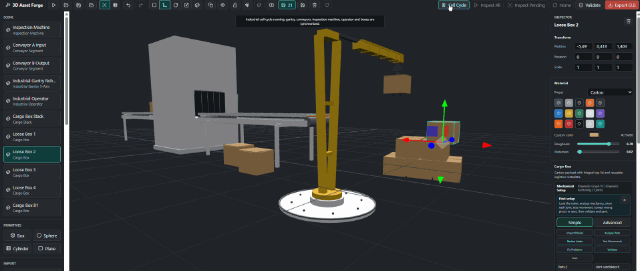
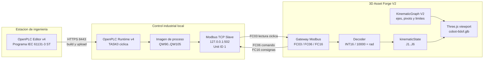
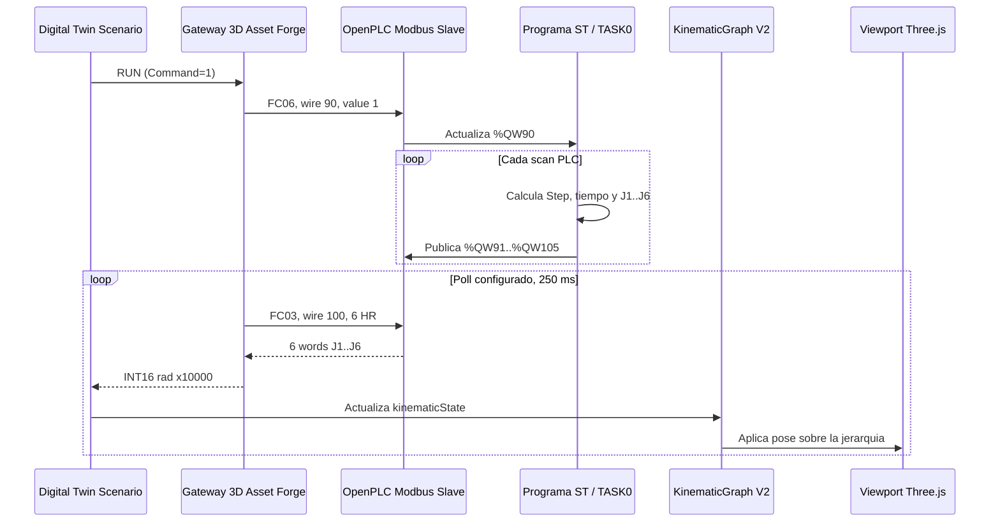
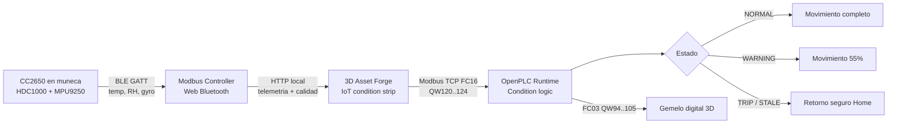

# 3D Asset Forge

Plataforma profesional en JavaScript para crear, importar, validar, articular y exportar objetos 3D preparados para motores en tiempo real.


## Objetivo

3D Asset Forge es un entorno de trabajo 3D centrado en la preparacion practica de assets. La plataforma combina generacion procedural, importacion de modelos, ajuste inteligente de escala, deteccion de articulaciones, validacion de movimientos y exportacion GLB en un unico flujo.

El objetivo principal es reducir el trabajo manual necesario para preparar modelos 3D descargados, mecanicos, roboticos, vehiculares o de simulacion. La plataforma busca detectar pivotes, ejes y articulaciones, permitir validar como debe moverse cada pieza y guardar ese aprendizaje para futuras demos o exportaciones.

## Capacidades Actuales

- Generadores procedurales de objetos hard-surface listos para prototipos.
- Importacion directa de `.glb`, `.fbx`, `.dae`, `.obj` y `.3ds`.
- Mensajes claros para formatos propietarios que requieren conversion previa: `.blend`, `.c4d`, `.max`, `.sldprt` y `.sldasm`.
- Ajuste inteligente de escala para modelos demasiado grandes o desplazados.
- Deteccion de articulaciones a partir de nombres, pivotes, huesos y jerarquias importadas.
- Reconstruccion mecanica para modelos `.3ds` donde los pivotes y las mallas visibles llegan como objetos planos.
- Controles logicos por articulacion: `Rotate X/Y/Z` o `Slide X/Y/Z`.
- Motion Trainer para validar movimientos test por test.
- Demo aprendida basada solo en movimientos validados y ordenados por el usuario.
- Warehouse de piezas con dashboard separado, categorias, clases y miniaturas reales.
- Guardado fisico de piezas y conjuntos como `.glb` dentro de `project-warehouse/<projectId>/`.
- Guardado permanente de cambios del workspace: color, transformaciones, copias y objetos importados.
- Borrado permanente desde workspace o warehouse, eliminando tambien el fichero local asociado.
- Componentes funcionales persistentes con interfaces mecanicas, propiedades, subgrafo cinematico y validacion de assemblies.
- Soporte para rigs profesionales de celda robotica: cobot 6 ejes, brazo industrial 6 ejes con pinza y cinta transportadora parametrica.
- Celda industrial real desde `scenario_1`: robot gantry, cintas, maquina de inspeccion, operador y cajas cargados como GLB reales.
- Ciclo de celda sincronizado con captura por contacto: el brazo solo levanta una caja si la pinza toca una caja suelta colocada manualmente.
- Digital Twin Scenario con Modbus local, entidad fisica simulada, gemelo 3D, registros HR, mando visual y entrada BLE multi-dispositivo.
- Kinematic Authoring M1 para corregir joints, ejes arbitrarios, origen fisico, limites, estado home y validacion del grafo cinematico.
- Calibracion de piezas aisladas: centro de referencia calculado desde la malla, correccion manual persistente y prueba visual sobre ese pivot.
- Preflight de exportacion y perfiles GLB para uso generico, Unity, Unreal y Godot.
- Modo navegador y base Tauri para aplicacion de escritorio.

## Plataforma En Accion

### Modelo Articulado Importado

La plataforma normaliza modelos grandes, detecta articulaciones mecanicas y muestra controles especificos en el inspector.


### Motion Trainer

Motion Trainer lanza pruebas de movimiento una por una. El usuario valida o rechaza cada movimiento candidato para ensenar a la plataforma como debe moverse ese modelo concreto.


### Secuencia De Movimiento Aprendida

Los movimientos validados se guardan, se muestran en una lista y se pueden ordenar. La demo automatica usa esa secuencia aprendida en lugar de aplicar movimientos genericos.


### Desmantelado En Piezas

Un modelo robotico importado puede separarse en piezas reutilizables. Cada pieza queda clasificada por categoria y clase dentro del warehouse, con miniatura real generada desde la escena.


### Reconstruccion En Workspace

Las piezas guardadas pueden volver al escenario como objetos independientes. Esto permite reconstruir conjuntos, modificar piezas sueltas, crear variantes y guardar nuevas versiones.


### Modelo Robotico Importado

El flujo empieza con modelos reales importados, no con placeholders. La plataforma mantiene la visualizacion del asset completo mientras permite extraer piezas y convertirlas en componentes reutilizables.


## Casos De Uso Y Valor

3D Asset Forge esta pensada para convertir modelos 3D complejos en una libreria reutilizable de componentes. Esto reduce tiempo de preparacion, evita rehacer piezas y permite crear variantes comerciales a partir de assets existentes.

Casos de uso principales:

- Preparacion de catalogos 3D: desmontar modelos de vehiculos, brazos roboticos, maquinaria o productos y guardar piezas independientes con miniaturas.
- Reutilizacion de componentes: extraer bases, articulaciones, ruedas, paneles, brazos o pinzas para crear nuevos conjuntos sin volver al modelo original.
- Prototipado industrial: importar piezas guardadas al workspace, combinarlas y guardar conjuntos como assemblies reutilizables.
- Variantes de producto: cambiar color, escala o posicion de una pieza y guardarla como nuevo GLB permanente.
- Control de inventario visual: revisar categorias, clases, codigos, peso del warehouse y previews antes de importar una pieza.
- Pipeline comercial: preparar assets limpios para GLB, Unity, Unreal, Godot, web viewers, configuradores y demos de producto.


## Como Funciona

Manual operativo separado:

- [Manual de uso: warehouse, piezas y workspace](docs/manual-uso-warehouse.md)

### 1. Crear O Importar

El usuario puede crear objetos procedurales desde el panel de generadores o importar un modelo existente. El modelo importado queda embebido dentro del documento del proyecto como data URL, por lo que puede guardarse y restaurarse sin depender de rutas externas.

Formatos soportados directamente:

| Formato | Extension | Notas |
| --- | --- | --- |
| glTF Binary | `.glb` | Formato recomendado para intercambio moderno |
| FBX | `.fbx` | Comun en pipelines de animacion y videojuegos |
| Collada | `.dae` | Util en flujos DCC antiguos |
| OBJ | `.obj` | Importacion de mallas estaticas |
| 3DS | `.3ds` | Soportado con reconstruccion de jerarquia mecanica |

Para robots y maquinaria articulada, `.glb` es la opcion preferida cuando existe. Un `.obj` normalmente solo trae malla y material basico; no guarda una escena mecanica moderna con jerarquia, nodos funcionales, clips, pivotes o metadatos de rig. Por eso algunos modelos `.obj` se ven bien como geometria estatica pero no se mueven correctamente hasta que la plataforma reconstruye un rig externo. En cambio, `.glb` puede conservar nodos, transforms, materiales PBR y datos de animacion en un unico fichero. En `IRAmk4`, la alternativa valida es `.3ds`, porque contiene una separacion de objetos que permite recuperar mejor la estructura mecanica que el OBJ plano.

### 2. Normalizar Escala

Muchos modelos descargados o exportados desde CAD llegan con escalas enormes, muy pequenas o desplazados del suelo. El importador calcula limites originales, limites normalizados, escala de importacion y offset. El resultado queda ajustado a una escena practica sin destruir los datos originales.

### 3. Detectar Articulaciones

La plataforma analiza objetos, huesos y nombres para inferir comportamiento mecanico:

- ruedas y neumaticos se convierten en controles rotativos;
- puertas y paneles se tratan como bisagras;
- brazos, munecas, cabezales y ejes se tratan como articulaciones rotativas;
- railes, pistones y piezas telescopicas se tratan como desplazamientos lineales;
- huesos de esqueleto se tratan como articulaciones de rig.

En modelos `.3ds` como `IRAmk4.3ds`, la plataforma reconstruye una jerarquia mecanica agrupando mallas visibles bajo pivotes detectados como `BASE_ROT`, `ARM_1`, `ARM_2`, `HEAD_ST` y `HEAD_ND`.

### 4. Controlar Movimiento De Forma Logica

El inspector muestra un unico control logico por articulacion. Una base rotatoria usa `Rotate Y`; un actuador lineal usa `Slide X/Y/Z`; una rueda usa un eje rotativo. Esto evita movimientos sin sentido, como desplazar verticalmente una pieza que realmente debe rotar.

### 5. Entrenar Movimiento Especifico Del Modelo

Motion Trainer genera candidatos para cada articulacion detectada. El flujo es:

1. Pulsar `Start Tests`.
2. Observar el movimiento candidato actual.
3. Pulsar `Validate` si el movimiento es correcto.
4. Pulsar `Reject` si no tiene sentido.
5. Repetir hasta construir el mapa de movimiento del modelo.
6. Ordenar los movimientos validados con las flechas.
7. Pulsar `Start Learned Demo` para reproducir la secuencia aprendida.

Los datos aprendidos se guardan en el documento como `validatedMotions`, incluyendo articulacion, tipo de movimiento, eje, limites, amplitud y orden.

### 6. Guardar Piezas En Warehouse

El warehouse permite convertir piezas desmontadas o conjuntos creados en el escenario en objetos 3D independientes. Las piezas permanentes se guardan como `.glb` fisicos en el proyecto local y se indexan en `manifest.json`.

Flujo principal:

1. Importar un modelo con `3D Model`.
2. Pulsar `Dismantle selected model into warehouse`.
3. Abrir `Warehouse dashboard`.
4. Pulsar `Save All`.
5. Refrescar la pagina.
6. Pulsar `Load Saved`.
7. Importar una pieza con `Import saved warehouse object to workspace`.

Si se modifica una pieza en el workspace, el boton `Save workspace changes permanently` se activa y guarda fisicamente esos cambios. Las miniaturas del warehouse se guardan tambien en el manifest para que despues del refresh no aparezca el icono generico.

Los detalles completos estan en:

- [Manual de uso: warehouse, piezas y workspace](docs/manual-uso-warehouse.md)

### 7. Base Mecanica Funcional

Las piezas reutilizables ya no se tratan solo como geometria. Cada pieza almacenada puede llevar un `FunctionalComponent` con:

- geometria y material;
- transformacion local, origen y limites;
- propiedades mecanicas inferidas;
- interfaces mecanicas como ejes, bisagras, mounts, shafts, rails, supports o grippers;
- subgrafo `KinematicGraph` asociado a la pieza original.

Cuando se guarda un conjunto, la plataforma crea un `FunctionalAssembly` persistente. El assembly conserva componentes, conexiones sugeridas, joints, limites, jerarquia y un `KinematicGraph` reconstruido del conjunto.

El validador de assemblies detecta componentes flotantes, conexiones incompatibles, limites contradictorios, referencias rotas, duplicados y ciclos cinematicos antes de considerar valido el conjunto.

### 8. Kinematic Authoring M1

El inspector del modelo importado incluye `Kinematic Authoring`, una capa no destructiva basada en `KinematicGraph V2`. Su objetivo es reconstruir o corregir una maquina como una cadena real:

```text
Rigid Part / Link -> Joint -> Rigid Part / Link
```

Funciones actuales:

- crear un joint candidato desde dos piezas seleccionadas en modo `Parts`;
- editar `Parent`, `Child`, `Type`, `Axis`, `Origin` y limites;
- usar atajos de eje `X`, `Y`, `Z` o escribir un eje arbitrario como `[0.707, 0.707, 0]`;
- seleccionar el `Joint Origin` directamente sobre el modelo en el viewport;
- editar visualmente el eje con un gizmo 3D;
- definir un eje con `Two-Point Axis`, seleccionando A y B sobre el modelo;
- ver pivot, frame local y eje activo como helpers de escena no destructivos;
- definir coupling/mimic entre joints con `driverJointId`, `multiplier` y `offset`, por ejemplo dos dedos de gripper con movimiento opuesto;
- probar el joint con un slider sin reimportar ni reconstruir el modelo;
- aceptar, rechazar, borrar o resetear el joint;
- volver a `Home` para recuperar la configuracion cero;
- validar raiz, referencias, ejes, origen, limites, ciclos, duplicados y piezas huerfanas.

La definicion estructural queda en `kinematicGraph`; la pose de prueba queda separada en `kinematicState`. Esto evita acumular errores y permite guardar/recuperar el mecanismo sin convertir la geometria original en un asset destructivo.

#### Advanced Mechanical Rig

El modo `Advanced` lleva el authoring mecanico al viewport y organiza las herramientas en cuatro vistas compactas. Adapta al dominio industrial los principios de rigging profesional de Blender: cadena jerarquica, controles visibles, coordenadas locales, limites, pose de reposo y animacion por keyframes. La geometria no se convierte en un esqueleto deformable: `KinematicGraph V2` sigue siendo la fuente de verdad y cada pieza permanece rigida e intacta.



- `Rig`: inspecciona la cadena parent/joint/child y crea controles 3D persistentes. Un joint revolute usa un aro, uno prismatico una flecha y uno fixed un marcador.
- `Pose`: mueve cada joint dentro de sus limites, vuelve a `Home`, muestra su frame local y registra la pose completa o un joint.
- `Constraints`: edita tipo, eje, pivot, limites, velocidad, damping, friction y coupling/mimic; tambien ejecuta el diagnostico estructural.
- `Animation`: crea acciones reutilizables, controla FPS, interpolacion, auto-key, duracion, loop, timeline y keyframes por joint.

El flujo de uso es:

```text
Importar robot -> Mechanical -> Advanced -> Rig
  -> revisar jerarquia y controles
  -> Pose / Constraints para calibrar
  -> Animation para registrar la secuencia
  -> Save Rig -> refrescar -> continuar desde la misma definicion
```

Tutorial detallado:

1. Importa el robot completo y selecciona su objeto raiz en `Scene`. Antes de editar, comprueba que todas las piezas se ven y que el encuadre es correcto.
2. Abre `Mechanical`, activa `Advanced` y entra en `Rig`. Recorre la jerarquia desde la base; cada fila muestra la pieza, el joint de entrada, su tipo y su eje dominante.
3. Selecciona un joint y pulsa su control para localizarlo en el viewport. Rojo representa X, verde Y, azul Z y amarillo el eje mecanico activo.
4. Abre `Constraints` y pulsa `Show`. El pivot debe coincidir con el centro real de la bisagra, eje o rail. Si no coincide, usa `Pick pivot` sobre la geometria.
5. Si la orientacion es incorrecta, usa `Edit axis`. Un joint `Revolute` gira exclusivamente alrededor del eje; un `Prismatic` se desplaza exclusivamente sobre el eje; `Fixed` no admite movimiento.
6. Introduce `Lower`, `Upper` y `Velocity`. Las rotaciones usan radianes y las traslaciones unidades del modelo. Prueba primero intervalos pequenos para evitar atravesar otras piezas.
7. Configura `Damping` y `Friction` cuando necesites una respuesta mecanica mas controlada. Para una pinza, selecciona el joint conductor en `Mimic driver`; usa un multiplicador negativo para movimiento opuesto.
8. Abre `Pose`, mueve un joint cada vez y observa toda su cadena descendente. Pulsa `Home` despues de cada grupo de pruebas para confirmar que la pose original se recupera sin drift.
9. Abre `Animation`, crea una `Action`, configura FPS, duracion e interpolacion. Situa el cursor temporal, prepara la pose y pulsa `Key Pose`. Repite el proceso para construir la secuencia.
10. Reproduce la accion completa, corrige limites o keyframes y revisa los diagnosticos. Solo guarda cuando no queden errores estructurales.
11. Pulsa `Save Rig`, refresca la aplicacion, vuelve a seleccionar el robot y reproduce la misma accion. La jerarquia, controles, constraints y keyframes deben mantenerse.

La misma guia esta disponible dentro del dashboard mediante `Help`, en la cabecera de `Advanced Rig & Animation`. Se abre como una nota superpuesta y sus botones llevan directamente a `Rig`, `Constraints`, `Pose` o `Animation` sin reducir permanentemente el escenario 3D.

La implementacion incorpora una mejora especifica frente a un rig visual generico: los controles conocen la semantica mecanica del joint, sus limites fisicos, su coupling y sus diagnosticos. Los keyframes solo cambian `kinematicState`; nunca reparentan, sustituyen ni deforman la geometria fuente.

### 9. Calibracion De Piezas Desmontadas

Una pieza desmontada no hereda los movimientos del modelo completo. Al abrir `Analyze piece`, la plataforma crea una definicion limpia y realiza este flujo antes de permitir que se guarde como componente funcional:

```text
Pieza aislada
  -> centro de referencia geometrico
  -> pivot y ejes locales visibles
  -> tipo de movimiento y eje elegidos
  -> prueba de movimiento acotada
  -> validacion y persistencia en Warehouse
```

El centro se calcula directamente sobre los triangulos reales de la malla, en coordenadas locales de la pieza:

1. Centroide de volumen mediante tetraedros con densidad uniforme, cuando la malla forma un solido cerrado.
2. Centroide ponderado por area, cuando el modelo es una superficie abierta o tiene winding inconsistente.
3. Centro de bounds como respaldo seguro para assets sin triangulos validos.
4. Correccion manual con `Correct reference center`: el clic sustituye la estimacion y se guarda como `manual`.

La referencia se persiste como `pieceReferenceCenter` con posicion, metodo, confianza, numero de triangulos y fecha. Tambien se copia al `FunctionalComponent`, al pivot del joint y al objeto independiente almacenado. Al serializar una pieza para Warehouse, sus puntos y ejes se convierten al espacio de coordenadas del nuevo asset; asi el pivot no queda desplazado al volver a cargarla.


La pieza no se mueve durante el calculo. Despues se selecciona el comportamiento mecanico: estatica, rotacion pura alrededor del pivot, traslacion pura sobre un eje, o movimiento entre dos extremos. Las pruebas siempre arrancan desde `Home`, respetan limites y vuelven a `Home` al terminar. Una rotacion no introduce traslacion adicional; una traslacion se proyecta exclusivamente sobre su eje configurado.


### Celda Robotica Profesional

Los activos de `3d imported models/celda_robotica/` se integran con su contrato mecanico documentado. La plataforma lee los metadatos `robot-arm-rig/1.1` y `conveyor-rig/1.0`, conserva la geometria original y aplica un solo valor local por articulacion. Los hijos siguen al padre por jerarquia; las mallas no se reparentan ni se animan como piezas sueltas.

**Cobot colaborativo 6 ejes**

J1 gira sobre Y, J2-J4 sobre Z, J5 sobre X y J6 sobre Y. Los clips importados son `Ciclo_Asistencia`, `Guiado_Manual` y `Demo_Ejes`.

Vista frontal:


Vista lateral:


Vista superior:


**Brazo industrial 6 ejes con pinza**

El modelo estatico `industrial-arm-6dof.obj` se puede recuperar desde la documentacion de la celda: J1 Y, J2 Z, J3 Z, J4 Y, J5 Z, J6 Y y dos dedos lineales opuestos en X. La pinza usa coupling/mimic para que los dedos se muevan de forma simetrica. Para la demo visual del README se usa `industrial-arm-6dof.glb`, porque conserva mejor la escena, los materiales y la estructura funcional.


**Cinta transportadora parametrica**

La cinta no depende de keyframes de malla. El valor del rodillo calcula distancia recorrida, desplaza la textura de la banda, rota R1/R2 sobre Z, mueve las piezas opcionales sobre +X y acciona el tope S1 sobre Y.


### Celda Industrial Real Scenario 1

La plataforma incluye una variante real de la celda industrial en `3d imported models/scenario_1/`. A diferencia del pack procedural `Industrial Cell`, el boton `Real Cell` carga GLB reales:

- `gantry-robot.glb`
- `conveyor-segment.glb`
- `inspection-machine.glb`
- `operator.glb`
- `cargo-box.glb`

Estos assets conservan la jerarquia funcional necesaria para el movimiento:

- `G1_column_yaw`, `G2_boom_extend`, `G3_head_lift`, `G4_head_roll` y `G5_finger_*` para el robot gantry.
- `R1_drive_roller`, `R2_idler_roller`, `S1_stopper` y `BELT_surface` para las cintas.
- `M3_door_hinge`, `M4_fan` y `M6_curtain_*` para la maquina de inspeccion.
- `O1_hips_yaw`, `O2_spine_pitch`, `O4_head_yaw`, `O6_shoulder_R`, `O7_elbow_R` y equivalentes izquierdos para el operador.
- `L1_lid_hinge` para la caja.

El flujo real es:

1. Pulsar `Real Cell`.
2. Seleccionar una `Loose Box`.
3. Moverla manualmente en el escenario con el modo axial.
4. Acercarla al recorrido de la pinza.
5. Pulsar `Cell Cycle`.
6. Si la pinza toca la caja, el brazo la levanta y la deja sobre la cinta.
7. Si no hay contacto, el brazo ejecuta el ciclo vacio y no teletransporta ninguna caja.

La siguiente imagen movil sale del video `planta industrial.mp4`. Sirve como referencia visual del comportamiento esperado para la celda completa: escena industrial en movimiento, lectura clara del flujo y coordinacion entre elementos de planta.



La celda real reutiliza el mismo `KinematicGraph` que la celda procedural, pero la geometria visible sale de los GLB de `scenario_1`. Esto permite comparar el prototipo JS contra assets reales sin duplicar la logica mecanica.

La geometria por si sola no puede demostrar la funcion fisica real de una pieza sin sus conexiones, contactos o especificacion mecanica. Por eso la plataforma automatiza el calculo y las invariantes geometricas, pero deja al usuario validar la funcion mecanica observada antes de aceptarla. Esta separacion evita inventar articulaciones falsas.

### Persistencia De M1

M1 separa tres responsabilidades:

- `kinematicGraph`: definicion mecanica persistente, con joints, parent/child, origins, axes, limits, status, evidence y mimic.
- `kinematicState`: estado de pose/home persistente o restaurable, sin reescribir la definicion.
- asset 3D pesado: geometria original o referencia al asset persistente correspondiente.

En navegador, los modelos grandes no deben depender de duplicarse dentro de `localStorage`. La definicion cinemática puede persistirse como proyecto compacto y el asset debe recuperarse desde el mecanismo persistente disponible, como Warehouse/storage fisico o referencia de proyecto. El estado visual temporal de la UI no forma parte de la definicion mecanica.

## Estrategia De Rendimiento

La plataforma esta optimizada para evitar recargas innecesarias:

- los modelos importados se cachean despues del parseo;
- la geometria pesada no se reconstruye cuando solo cambia una pose;
- los sliders manuales aplican transformaciones directamente sobre objetos Three.js ya cargados;
- la demo automatica corre dentro del render loop;
- cambios de seleccion, herramienta o snap no fuerzan una reconstruccion completa;
- se guardan rotaciones y posiciones base para aplicar cada movimiento desde un estado estable.

Esto es clave para modelos densos como `IRAmk4.3ds`, que contiene millones de triangulos.

## Estructura Del Proyecto

```text
src/
  application/          Perfiles, validacion, cinematica, flujos de proyecto y modelo mecanico funcional
  domain/               Tipos principales, kinematics, mechanics, factories y generadores
  infrastructure/       Importadores, escena Three.js, exportacion GLB y storage
  presentation/         UI React, inspector, viewport y controles del editor
src-tauri/              Base para aplicacion de escritorio
docs/readme-assets/     Capturas y animaciones usadas por este README
3d imported models/     Modelos reales usados para pruebas, rigs y celdas industriales
project-warehouse/      Almacen local de piezas GLB permanentes en desarrollo
```

## Lanzar El Proyecto

Instalar dependencias:

```bash
npm install
```

En Windows PowerShell, si `npm` queda bloqueado por `npm.ps1`, usar:

```powershell
npm.cmd install
```

Arrancar el servidor de desarrollo:

```bash
npm run dev -- --port 5187 --strictPort
```

En Windows PowerShell:

```powershell
npm.cmd run dev -- --port 5187 --strictPort
```

Copiar solo el comando, no el prefijo del terminal. Por ejemplo, no copiar `PS C:\...\3D Asset Platform>`.

Si el puerto esta ocupado por una instancia anterior de la misma plataforma, usar:

```powershell
npm.cmd run dev:fresh -- --port 5187
```

Este comando cierra el servidor Vite anterior del proyecto y lo vuelve a abrir en el mismo puerto.

Abrir en el navegador:

```text
http://127.0.0.1:5187
```

Construir version de produccion:

```bash
npm run build
```

En Windows PowerShell:

```powershell
npm.cmd run build
```

Previsualizar la build:

```bash
npm run preview
```

## Modo Escritorio

El proyecto incluye una base Tauri para empaquetado de escritorio:

```bash
npm run desktop:dev
npm run desktop:build
```

La version de escritorio requiere tener instalado Rust/Tauri. El flujo en navegador funciona sin Rust.

## Digital Twin Scenario Con Modbus

La plataforma V2 incorpora un escenario de gemelo digital para comprobar comunicacion entre una entidad fisica simulada y el robot 3D. El boton esta en la barra superior, junto a `Cell Cycle`, `Inspect All` e `Inspect Pending`, con el nombre `Digital Twin Scenario`.

El mando visual ya no necesita iniciarse manualmente desde otra terminal durante el desarrollo. El boton `IoT Control Center`, situado inmediatamente antes de `Digital Twin Scenario`, inicia o reutiliza el servicio local equivalente a `npm.cmd run modbus:controller`. El centro aparece en un panel global superpuesto desde el borde derecho, accesible en Workspace, Warehouse y Digital Twin Scenario. La flecha lateral lo oculta sin desmontarlo: las sesiones BLE, dispositivos conectados y publicaciones de registros permanecen activas mientras el escenario recupera todo el espacio. El panel es responsive y usa el mismo dashboard servido en `http://127.0.0.1:8765`, con presentación transparente para la integración.

Arquitectura usada en esta fase:

```text
Mando visual / BLE IoT -> registros Modbus HR -> Digital Twin Scenario -> kinematicState -> robot 3D
```

El escenario mantiene dos vistas: la entidad fisica simulada publica registros y el gemelo digital aplica esos datos al modelo 3D seleccionado. La comunicacion usa un bridge HTTP local que expone paquetes y registros equivalentes a un flujo Modbus de prueba.

### PLC Virtual Industrial Integrado

La `Entidad Fisica Simulada` ya no es solamente un grupo de sliders. Incluye un runtime PLC con ejecucion ciclica e imagen de proceso:

- CPU con modos `STOP`, `RUN` y `FAULT`;
- programa secuencial `IDLE`, `HOMING`, `AUTO` o `FAULT`;
- scan configurable entre 5 y 500 ms, contador de ciclos y metricas last/average/maximum;
- watchdog de ciclo;
- entradas digitales para E-Stop, puerta de seguridad, servo ready y selector AUTO/MANUAL;
- salidas digitales para motor enable, ciclo activo, solicitud Home y lampara de fallo;
- enclavamiento de marcha y parada;
- alarmas persistentes con reset condicionado;
- arbitraje de autoridad entre PLC interno y controller Modbus externo.

Secuencia segura de operacion:

1. Verificar `E-STOP READY`, `GUARD CLOSED` y `SERVO READY`.
2. Seleccionar `AUTO` para ciclo automatico o `MANUAL` para homing/configuracion.
3. Si existe un controller externo activo, pulsar `Disconnect Client`; nunca se permiten dos maestros de escritura simultaneos.
4. Pulsar `Run`. La CPU pasa de `STOP/IDLE` a `RUN/AUTO` y habilita `Q0.0 Motor enable`.
5. Los valores del proceso se codifican en registros HR, se transmiten como frames Modbus TCP y se decodifican en el gemelo.
6. Abrir una puerta, quitar `Servo Ready` o disparar E-Stop fuerza `FAULT`, elimina motor enable y detiene el movimiento.
7. El reset se rechaza mientras el circuito de seguridad siga abierto. Restaurar primero las entradas y despues pulsar `RESET FAULT`.
8. Tras el reset la CPU queda en `STOP`; es necesario pulsar `Run` de nuevo.

Este runtime reproduce semantica y diagnostico PLC para simulacion, integracion y formacion. No es un PLC de seguridad certificado, no ofrece tiempo real duro y no debe controlar directamente actuadores fisicos peligrosos. Una maquina real necesita PLC, safety PLC, drives, cableado y evaluacion de riesgos certificados.

### Conexion Alternativa A OpenPLC

El dashboard puede ceder la autoridad del robot a OpenPLC Runtime v4 mediante Modbus TCP real. OpenPLC Editor, OpenPLC Runtime y 3D Asset Forge son procesos diferentes: conectar el Editor a la API del Runtime no implica que el PLC este ejecutando un programa ni que Modbus este disponible.

#### Esquema completo PLC - gemelo digital

La integracion activa separa claramente ingenieria, control, transporte y representacion. OpenPLC ejecuta el programa ciclico; Modbus TCP transporta palabras de 16 bits; el gateway local valida y decodifica el protocolo; `KinematicGraph V2` aplica el estado sin reconstruir ni modificar la geometria fuente.



Topologia de red local:

```text
OpenPLC Editor
  127.0.0.1:8443 HTTPS
          |
          v
OpenPLC Runtime [RUNNING]
  TASK0 -> programa ST -> process image %QW
  Modbus Slave 127.0.0.1:502 / Unit 1
          |
          | Modbus TCP ADU: MBAP + PDU
          | FC03 read holding registers
          | FC06 write single register
          | FC16 write multiple registers
          v
Vite/OpenPLC gateway 127.0.0.1:5187
  validacion -> INT16 firmado -> radianes
          |
          v
React state -> kinematicState -> KinematicGraph V2 -> Three.js robot
```

Flujo temporal de una orden de marcha:



Mapa de senales y conversion:

| Senal | Variable OpenPLC | Wire Modbus | Referencia humana | Sentido | Codificacion |
| --- | --- | ---: | ---: | --- | --- |
| Command | `%QW90` | 90 | HR40091 | Plataforma -> PLC | `0 STOP`, `1 RUN`, `2 HOME` |
| Status | `%QW91` | 91 | HR40092 | PLC -> plataforma | `0 STOP`, `1 RUN`, `2 HOME` |
| ActiveStep | `%QW92` | 92 | HR40093 | PLC -> plataforma | Paso `0..6` |
| ElapsedMs | `%QW93` | 93 | HR40094 | PLC -> plataforma | Milisegundos del ciclo |
| J1..J6 | `%QW100..105` | 100..105 | HR40101..40106 | PLC -> gemelo | `INT16`, radianes x 10000 |

El bloque `Robot mode` del dashboard escribe `%QW90` y es reutilizable para cualquier robot que implemente este perfil:

- `Manual` (`Command=0`): detiene el secuenciador y conserva las consignas J1..J6 escritas manualmente.
- `Auto` (`Command=1`): ejecuta continuamente la secuencia definida por el PLC.
- `Home` (`Command=2`): aplica y mantiene la pose Home hasta seleccionar otro modo.

Los botones envian una escritura Modbus FC06 real. En Manual, los controles de articulacion escriben `%QW100..105`; el programa ST relee esos words antes de publicarlos para no sobrescribir la orden del operador en el siguiente scan.

Para cada articulacion, OpenPLC calcula y publica:

```text
raw = INT(degrees * PI / 180 * 10000)
radians = INT16(raw) / 10000
```

El cast a `INT16` es obligatorio: por ejemplo, el word Modbus `59427` representa `-6109`, por tanto `-0.6109 rad`, aproximadamente `-35 grados`. Sin esta conversion a complemento a dos, las articulaciones negativas se interpretarian como giros positivos muy grandes.

Estado realmente implementado:

| Elemento | Estado | Evidencia |
| --- | --- | --- |
| Programa PLC IEC 61131-3 | Activo | PLC `RUNNING`, `TASK0` ejecutada por OpenPLC Runtime |
| Transporte Modbus TCP | Activo | Slave escuchando en `127.0.0.1:502`, Unit ID `1` |
| Lectura de telemetria | Activa | FC03 sobre wire `90..105` y `100..105` |
| Escritura de comandos | Activa | FC06 sobre wire `90`; FC16 disponible para bloques |
| Gateway de plataforma | Activo | `127.0.0.1:5187`, deteccion automatica del perfil cobot |
| Gemelo 3D | Activo | J1..J6 se aplican a `kinematicState` y al modelo Three.js |
| Brazo fisico industrial | No conectado | Requiere PLC/hardware, drives, robot y realimentacion de posicion reales |

En la configuracion actual, la parte fisica es el controlador OpenPLC ejecutando un programa industrial y publicando su imagen de proceso. El robot mostrado a la izquierda puede actuar como entidad fisica simulada, pero no debe confundirse con telemetria de un brazo fisico real. Para cerrar ese ultimo nivel sera necesario mapear feedback real del robot o sus drives hacia registros de entrada y definir watchdog, calidad, timestamp, modo seguro y autoridad de mando.

```text
OpenPLC Editor
  -> HTTPS API 127.0.0.1:8443 (build y upload)
  -> OpenPLC Runtime v4 (estado EMPTY / RUNNING)
  -> Modbus TCP FC03 / FC16
  -> gateway local 3D Asset Forge
  -> decoder INT16 firmado / 10000
  -> kinematicState
  -> robot 3D
```

El programa que reproduce el clip `Ciclo_Asistencia` de `Start Smart Demo` para `cobot-6dof.glb` esta en [`openplc/cobot-6dof-smart-demo/cobot_6dof_smart_demo.st`](openplc/cobot-6dof-smart-demo/cobot_6dof_smart_demo.st). El archivo tiene el formato POU admitido por OpenPLC Editor: bloque de declaraciones `VAR...END_VAR` seguido del cuerpo Structured Text. No deben anadirse wrappers `PROGRAM`, `FUNCTION` o `CONFIGURATION` al pegarlo en los dos paneles del Editor.

La variante [`cobot_6dof_smart_demo_amplified.st`](openplc/cobot-6dof-smart-demo/cobot_6dof_smart_demo_amplified.st) amplía el recorrido de J1-J6 mediante seis transiciones coordinadas y suavizado cubico. Mantiene exactamente el mismo mapa Modbus, por lo que puede sustituir el cuerpo del programa sin cambiar la configuracion de 3D Asset Forge.

#### Escenario IoT: robot adaptativo por condicion

El escenario industrial usa un TI CC2650 SensorTag fijado rigidamente a la muneca. El giroscopio observa movimiento angular anormal o impactos; temperatura y humedad aportan contexto ambiental para proteger proceso, herramienta y electronica. Esta combinacion sigue el principio de monitorizacion multivariable: la vibracion no se interpreta aislada de las condiciones operativas. La norma ISO 13373-1 describe adquisicion, ubicacion del transductor, condiciones de operacion, monitorizacion continua y parametros complementarios como temperatura; el SensorTag integra movimiento MPU9250 y humedad HDC1000 con notificaciones BLE configurables ([ISO 13373-1](https://www.iso.org/standard/21831.html), [TI CC2650 SensorTag](https://www.ti.com/tool/TIDC-CC2650STK-SENSORTAG)).



```text
Sensor fisico -> BLE -> timestamp/calidad -> Modbus inputs -> PLC
PLC -> NORMAL/WARNING/TRIP/STALE -> J1..J6 -> gemelo 3D
```

Mapa del programa [`cobot_6dof_iot_condition_monitoring.st`](openplc/cobot-6dof-smart-demo/cobot_6dof_iot_condition_monitoring.st):

| Wire | Senal | Escala | Uso PLC |
| ---: | --- | --- | --- |
| 120 | temperatura | C x100 signed | warning 45 C, trip 55 C |
| 121 | humedad | %RH x100 | warning 75%, trip 85% |
| 122 | magnitud gyro | grados/s x100 | warning 120, trip 220 grados/s |
| 123 | edad | ms | stale por encima de 2500 ms |
| 124 | validez | 0/1 | dato valido |
| 125 | secuencia | contador UINT16 | detectar actualizacion y trazabilidad |
| 126 | calidad/capacidades | bitfield | bit 0 valido, 1 fresco, 2 origen, 3 accel, 4 gyro, 5 ambiente, 6 magnetometro |
| 127 | politica PLC | 0/1 | 0 condition monitor, 1 motion permit demo |

La plataforma actua como gateway BLE/Modbus: recibe GATT, decodifica unidades, anade edad, secuencia, calidad y capacidades, y escribe `%QW120..126` como bloque de registros. OpenPLC es la autoridad de decision. Publica su reaccion en `%QW94..96` (`AlarmCode`, `ConditionState`, `SpeedPermille`) y las consignas articulares en `%QW100..105`; 3D Asset Forge lee ambas zonas y muestra tanto la decision como el movimiento resultante. Modbus define registros de 16 bits y FC03/FC16 para lectura/escritura de bloques, por lo que escalas, signedness y offset deben permanecer explicitos ([Modbus Application Protocol V1.1b3](https://www.modbus.org/file/secure/modbusprotocolspecification.pdf)).

Estados de reaccion visibles:

| ConditionState | Reaccion PLC | Resultado |
| ---: | --- | --- |
| 0 | NORMAL | ciclo automatico completo |
| 1 | WARNING / DERATE | recorrido reducido al 55% |
| 2 | TRIP / HOLD | movimiento inhibido y retorno Home |
| 3 | STALE / HOLD | dato ausente, invalido o antiguo; movimiento inhibido |

`Motion permit demo` (`%QW127=1`) demuestra causalidad IoT: exige giroscopio disponible y actividad superior a `3 deg/s`; tras 2 segundos sin actividad genera alarma 5 y HOLD. Si el perfil no tiene giroscopio genera alarma 6. Es una demostracion de supervision, no una funcion de seguridad. Un paro de seguridad industrial requiere arquitectura, componentes y validacion de seguridad independientes; el SensorTag y Modbus TCP sin seguridad funcional no sustituyen ese sistema.

Para que la reaccion exista realmente hay que cargar y ejecutar [`cobot_6dof_iot_condition_monitoring.st`](openplc/cobot-6dof-smart-demo/cobot_6dof_iot_condition_monitoring.st). Con `cobot_6dof_smart_demo.st` o la variante amplified, OpenPLC ignora `%QW120..127` y ejecuta solamente la secuencia automatica. El CC2650 expone Movement de nueve ejes y sensores ambientales; cada servicio GATT debe habilitarse por separado ([TI CC2650 SensorTag](https://www.ti.com/tool/CC2650STK), [tabla GATT oficial de TI](https://git.ti.com/cgit/sensortag-20-android/sensortag-20-android/tree/sensortag20/BleSensorTag/src/main/res/xml/gatt_uuid.xml?h=master)).

Los umbrales no son limites universales ni certificados. Deben obtenerse de una baseline repetible en cada fase del ciclo, validar ruido, montaje y tasa de muestreo, y ajustarse a la documentacion del fabricante del robot. El SensorTag de desarrollo tampoco sustituye sensores industriales con grado de proteccion, seguridad funcional y calibracion trazable.

La comparacion completa con ISO 23247, ISO 13373, OPC UA Robotics/Machinery, IEC 62443 y patrones de plataformas industriales esta en [Industrial Robot, PLC and IIoT Architecture Review](docs/INDUSTRIAL_ROBOT_PLC_IOT_RESEARCH.md). El contrato ampliado añade secuencia `%QW125`, calidad `%QW126`, identidad de muestra, timestamps de origen/recepcion y cadena local de procedencia.

#### Proyecto OpenPLC Editor

La configuracion minima del proyecto debe contener:

```text
Program POU: main
Task:        task0
Trigger:     Cyclic
Interval:    T#20ms
Priority:    1
Instance:    instance0
Binding:     instance0 -> task0 -> main
Device:      OpenPLC Runtime v4
IP Address:  127.0.0.1
```

El campo del Editor es `IP Address`, no una URL. Debe contener `127.0.0.1`, sin `https://` y sin puerto. El Editor v4 usa la API HTTPS oficial del Runtime en `8443`. Un asterisco en `* Configuration` significa que el cambio todavia no esta guardado. El archivo persistido `devices/configuration.json` debe indicar `"deviceBoard": "OpenPLC Runtime v4"`; si conserva `OpenPLC Simulator`, las acciones de transferencia al Runtime no quedan habilitadas.

#### Runtime y Modbus Slave

La instalacion Windows utilizada por el proyecto se encuentra normalmente en `%LOCALAPPDATA%\OpenPLC Runtime\openplc-runtime`. La primera linea de `plugins.conf` debe habilitar `modbus_slave` con el campo `enabled` a `1`. El archivo `core/src/drivers/plugins/python/modbus_slave/modbus_slave_config.json` usa esta configuracion local segura:

```json
{
  "network_configuration": {
    "host": "127.0.0.1",
    "port": 502
  },
  "buffer_mapping": {
    "holding_registers": {
      "qw_count": 1024,
      "mw_count": 0,
      "md_count": 0,
      "ml_count": 0
    },
    "coils": {
      "qx_bits": 8192,
      "mx_bits": 0
    },
    "discrete_inputs": {
      "ix_bits": 8192
    },
    "input_registers": {
      "iw_count": 1024
    }
  },
  "word_order": "high_word_first"
}
```

Los nombres son estrictos: esta version espera `network_configuration` y `buffer_mapping` en singular. Si se usan `host`/`port` en la raiz o `buffer_mappings` en plural, el plugin los ignora, muestra `network_configuration section missing or incomplete` y trata de enlazar su IP predeterminada. El bind se limita a `127.0.0.1`: el PLC de desarrollo no queda expuesto a la red. Para acceso remoto debe existir una decision explicita de red, autenticacion, segmentacion y firewall; no se debe sustituir `127.0.0.1` por `0.0.0.0` por comodidad.

#### Mapa del cobot

OpenPLC v3 expone `%QWn` como Holding Register wire `n`. OpenPLC Runtime v4 dirige los Holding Registers al buffer `int_output` desde `holding_registers_start_buffer`. Con inicio de buffer cero, el perfil del cobot es:

| Direccion ST | Wire | Referencia 4xxxx | Tipo | Funcion |
| --- | ---: | ---: | --- | --- |
| `%QW90` | 90 | HR40091 | `UINT` | Command: `0 STOP`, `1 RUN`, `2 HOME` |
| `%QW91` | 91 | HR40092 | `UINT` | Status |
| `%QW92` | 92 | HR40093 | `UINT` | ActiveStep `0..6` |
| `%QW93` | 93 | HR40094 | `UINT` | Tiempo de ciclo en ms |
| `%QW100` | 100 | HR40101 | `INT16` | J1 radianes x10000 |
| `%QW101` | 101 | HR40102 | `INT16` | J2 radianes x10000 |
| `%QW102` | 102 | HR40103 | `INT16` | J3 radianes x10000 |
| `%QW103` | 103 | HR40104 | `INT16` | J4 radianes x10000 |
| `%QW104` | 104 | HR40105 | `INT16` | J5 radianes x10000 |
| `%QW105` | 105 | HR40106 | `INT16` | J6 radianes x10000 |

Los seis joints ocupan seis words consecutivos, no doce. Los valores negativos viajan en complemento a dos. El decoder convierte cada word a `INT16` y divide por `10000` para recuperar radianes. `%MW` no se usa: en OpenPLC v3 esa memoria comienza en otra zona Modbus, habitualmente a partir de wire `1024`.

#### Centro de configuracion interno

La rueda situada en la esquina inferior izquierda abre `Internal Configuration Center` desde cualquier vista de 3D Asset Forge. Este centro hace visible y editable el contrato que antes estaba implicito en el codigo:

```text
OpenPLC wire %QWn <-> Modbus Holding Register HR(40001 + n)
```

Cada definicion muestra en tiempo real:

- estado habilitado;
- wire OpenPLC y referencia HR convencional calculada;
- semantica de la variable;
- codificacion y numero de words;
- sentido `Platform to PLC`, `PLC to platform` o `Read / write`;
- robot y joint asociados;
- ultimo valor procedente de OpenPLC o del PLC interno.

El centro se abre siempre en modo `READ ONLY`. Ningun campo, selector, alta, borrado o restauracion puede utilizarse hasta pulsar `Enable editing`; el boton cambia a verde para indicar de forma inequívoca que se esta modificando un contrato sensible. Las modificaciones se realizan sobre un borrador y no afectan al PLC, al `TwinProject` ni a `localStorage` mientras no se confirmen.

`Save changes` abre una confirmacion que describe el impacto: detener movimiento local, sustituir el mapa activo, reconstruir bindings y persistir la configuracion. Solo `Confirm and save` ejecuta estas operaciones. `Cancel changes`, cerrar el centro con cambios pendientes o intentar abandonar la edicion permite descartar el borrador y recuperar el ultimo mapa confirmado. No existe guardado automatico para este panel.

Todos los joints permanecen visibles en el inventario. En una conexion OpenPLC, `Quantity` limita cuantos bindings de joint se consultan para conservar compatibilidad con programas que solo declaran J1..J6; los bindings se ordenan por wire. Para publicar joints adicionales se debe ampliar el bloque del programa ST y la cantidad de words configurada, o deshabilitar los joints que no exponga ese PLC.

Las codificaciones disponibles son `UINT16`, `INT16`, `INT16 rad x10000` y `FLOAT32 BE`. `FLOAT32 BE` ocupa dos Holding Registers; el resto ocupa uno. El panel calcula el rango completo y marca en rojo cualquier solapamiento entre definiciones habilitadas.

El mapa se guarda en `localStorage` con la clave `assetForge.internalRegisterConfiguration.v1`. Al modificar una direccion, codificacion o joint, la plataforma detiene el movimiento local, invalida el frame anterior y reconstruye los bindings `TwinProject`. No se mantiene un mapa visual paralelo: el simulador Modbus local, las lecturas OpenPLC, las escrituras manuales, `Command`, `SensorPolicy` y la publicacion IoT consultan esta configuracion.

Flujo para asignar un registro nuevo a un joint:

1. Seleccionar el robot en el Workspace para que el centro enumere todos los joints no fijos de su `KinematicGraph`.
2. Abrir la rueda de configuracion y pulsar `Add register`.
3. Pulsar `Enable editing` y comprobar que el boton cambia a verde.
4. Definir `%QW`, semantica, codificacion y direccion de datos.
5. Seleccionar el robot y el joint. Un joint nuevo pasa a formar parte del proyecto Modbus en el siguiente arranque o frame.
6. Corregir cualquier `Address conflict`; el guardado queda bloqueado mientras exista un conflicto.
7. Pulsar `Save changes`, revisar el aviso y elegir `Confirm and save`.
8. Declarar el mismo `%QW` y tipo en el programa OpenPLC. La interfaz no puede crear memoria en un PLC fisico ni cambiar su programa ST automaticamente.
9. Conectar OpenPLC y comprobar la columna `Current`, el contador RX y la auditoria Modbus.

`Restore documented map` recupera las variables de sistema `%QW90..96` y de telemetria `%QW120..127`. Al volver a seleccionar un robot, sus joints se incorporan de nuevo a partir de `%QW100`. Las definiciones de sistema no se pueden borrar accidentalmente, pero pueden deshabilitarse.

Importante: modificar un mapa mientras existe una maquina fisica conectada cambia el contrato de comunicaciones. Debe mantenerse el PLC en `STOP`, comprobar tipos, escalas, limites y ausencia de colisiones, actualizar el programa ST y validar primero contra el gemelo digital. Este editor configura la integracion y la simulacion; no sustituye las funciones de seguridad certificadas del robot o PLC.

Configuracion de 3D Asset Forge:

```text
IP / host:       127.0.0.1
Modbus TCP port: 502
Unit ID:         1
HR start (wire): 100
Quantity:        6 words
Polling:         250 ms
Data:            INT16 rad x10000
```

#### Puesta en marcha

1. Iniciar una sola instancia de `Start OpenPLC Runtime` y mantener su consola abierta.
2. Esperar `Running on https://127.0.0.1:8443`. El estado inicial `EMPTY` es normal si aun no existe un programa cargado.
3. Abrir el proyecto en OpenPLC Editor, seleccionar `OpenPLC Runtime v4`, escribir `127.0.0.1`, guardar y pulsar `Connect`.
4. Ejecutar `Clean build and upload`. Un upload correcto genera `build/libplc_*.so` en el Runtime.
5. Pulsar `Run` y comprobar que el Runtime cambia de `EMPTY` a `RUNNING`. El plugin Modbus se inicia despues de cargar el programa; antes de ese momento `502` permanece cerrado.
6. Verificar en PowerShell:

```powershell
Test-NetConnection 127.0.0.1 -Port 8443
Test-NetConnection 127.0.0.1 -Port 502
```

7. En 3D Asset Forge, seleccionar el cobot, abrir `Digital Twin Scenario` y pulsar `Auto Detect Map`.
8. La deteccion prueba puertos `502/5020`, Unit ID configurado/`1`/`0` y valida la firma `%QW90..%QW105`. Debe mostrar `Detected %QW90..105` y los words `RAW [...]`.
9. Pulsar `Connect OpenPLC`. El indicador cambia a `ONLINE` y `RX` aumenta. FC03 actualiza el gemelo; una escritura manual usa FC06 o FC16 hacia OpenPLC.
10. Pulsar `Disconnect OpenPLC` para devolver la autoridad al PLC virtual interno.

#### Diagnostico

| Sintoma | Causa probable | Comprobacion / correccion |
| --- | --- | --- |
| `Connection failed` en Editor | Runtime detenido, IP escrita como URL o configuracion sin guardar | Iniciar Runtime; usar solo `127.0.0.1`; comprobar que desaparece `* Configuration` |
| No se puede compilar/transferir | Proyecto guardado como `OpenPLC Simulator` | Seleccionar y guardar `OpenPLC Runtime v4`; revisar `devices/configuration.json` |
| Runtime muestra `EMPTY` | No existe `libplc_*.so` | Ejecutar `Clean build and upload` y despues `Run` |
| `ECONNREFUSED 127.0.0.1:502` | Modbus no ha arrancado o el bind ha fallado | Confirmar PLC `RUNNING`; buscar `Modbus slave plugin listening on 127.0.0.1:502`; verificar `network_configuration`, `buffer_mapping` y `plugins.conf` |
| `network_configuration section missing or incomplete` | JSON con esquema antiguo o claves en la raiz | Usar exactamente `network_configuration.host`, `network_configuration.port` y `buffer_mapping` en singular; reiniciar el Runtime |
| `Failed to start server on <IP>:502` | IP no asignada al equipo o puerto ocupado | Corregir el host a `127.0.0.1`, cerrar la otra instancia si existe y reiniciar el Runtime |
| Excepcion Modbus 2 | Holding Register no mapeado | Ejecutar `Auto Detect Map`; revisar `%QW100..105` y buffer start |
| `RX` no aumenta | Endpoint, Unit ID o autoridad incorrectos | Revisar `127.0.0.1:502`, Unit `1` y desconectar otros controladores |
| `Address already in use` en `8443` | Otra instancia del Runtime sigue abierta | Cerrar todas las consolas Runtime y arrancar una sola instancia |

OpenPLC Runtime v3 esta fuera de mantenimiento. La integracion objetivo es Runtime v4 y se basa en operaciones Modbus TCP estandar FC03, FC06 y FC16. Consulte la [documentacion oficial del driver Modbus de OpenPLC Runtime](https://github.com/Autonomy-Logic/openplc-runtime/blob/main/core/src/drivers/README.md).

Para lanzar el mando visual en Windows PowerShell:

```powershell
npm.cmd run modbus:controller:fresh
```

Despues abre:

```text
http://127.0.0.1:8765
```

Por defecto, ambos lados usan:

```text
Controller IP: 127.0.0.1
Controller Port: 8765
State URL: http://127.0.0.1:8765/state
Write URL: http://127.0.0.1:8765/write
```

Flujo de uso:

1. Abrir la plataforma V2 y cargar un robot con `KinematicGraph`.
2. Pulsar `Digital Twin Scenario` en la barra superior.
3. En el panel del gemelo, comprobar `Modbus Controller Endpoint`.
4. Abrir el mando visual y pulsar `Connect`.
5. En la plataforma, pulsar `Visual Controller` para recibir los registros externos.
6. Usar `Advanced Details` para ver HR, words hex, paquetes y estado de cliente.
7. Usar `Disconnect Client` desde la plataforma para cortar el cliente conectado.
8. Para reconectar despues de un corte solicitado por la plataforma, pulsar `Connect` en el mando visual. Ese intento manual elimina el bloqueo de la sesion, 3D Asset Forge vuelve a detectar el mismo Session ID y reactiva RX automaticamente. No es necesario reiniciar ninguno de los dos procesos.

Mapa HR principal:

```text
HR 40101 / J1  giro base derecha/izquierda
HR 40103 / J2  hombro delante/atras
HR 40105 / J3  elevacion arriba/abajo
HR 40107 / J4  muneca vertical
HR 40109 / J5  muneca lateral
HR 40111 / J6  giro rotatorio de herramienta
```

El mando visual permite mover los registros con sliders, teclado, gamepad navegador o dispositivos BLE Texas Instruments. Soporta CC2650 SensorTag Movement, CC2541 SensorTag Accelerometer y CC2541 Keyfob Accelerometer.

En CC2650, el panel mantiene las coordenadas `X/Y/Z` del acelerometro usadas por el control del robot y muestra, sin sustituirlas, `GX/GY/GZ` del giroscopio, `MX/MY/MZ` del magnetometro, temperatura y humedad. La magnitud del giroscopio continua publicada en `%QW122` para conservar el contrato PLC existente; los vectores completos viajan en la telemetria trazable del dashboard.

La disponibilidad se transmite por canal. Un valor `0` solo se muestra si procede de una muestra real; sin muestras aparece `--`, y un perfil que no incorpora ese sensor indica `not available`. El CC2541 Keyfob ofrece acelerometro, mientras que el conjunto de movimiento y ambiente completo depende del perfil fisico del SensorTag conectado.

Uso BLE multi-dispositivo:

```text
1. Pulsar Connect BLE Device para anadir el primer SensorTag o Keyfob.
2. Repetir Connect BLE Device para anadir mas dispositivos.
3. Cada dispositivo aparece como IoT 1, IoT 2, etc.
4. Cada tarjeta muestra coordenadas independientes: X1/Y1/Z1, X2/Y2/Z2.
5. Cada registro HR puede tomar datos de Active, IoT 1, IoT 2 o una combinacion de ejes.
6. Ejemplo: HR 40101 J1 = X1 y HR 40103 J2 = X2.
7. Cada eje tiene escala propia: X Scale, Y Scale y Z Scale.
8. Drive Robot define que dispositivo se usa como Active.
```

La calibracion automatica permite grabar un movimiento real del SensorTag/Keyfob para un registro concreto. El controlador mide eje dominante, polaridad, energia y ruido, y guarda el perfil en el navegador para que el movimiento fisico tenga la misma direccion semantica que el robot 3D.

Comandos de validacion relacionados:

```powershell
npm.cmd run test:twin
npm.cmd run test:modbus-driver
npm.cmd run test:modbus-controller
npm.cmd run test:modbus-bridge
npm.cmd run test:plc-dashboard
```

## Assets Del README

Todas las imagenes y animaciones del README estan en:

```text
docs/readme-assets/
```

Assets actuales:

- `platform-overview.png`
- `imported-iramk4-inspector.png`
- `imported-iramk4-viewport.png`
- `motion-trainer-test.png`
- `learned-motion-sequence.png`
- `piece-reference-center.png` (evidencia Playwright del centro calculado)
- `piece-rotation-test.png` (evidencia Playwright de la prueba de rotacion)
- `cell-cobot-front-motion.gif` (cobot 6 ejes, vista frontal, clip `Ciclo_Asistencia`)
- `cell-cobot-side-motion.gif` (cobot 6 ejes, vista lateral, clip `Ciclo_Asistencia`)
- `cell-cobot-top-motion.gif` (cobot 6 ejes, vista superior, clip `Ciclo_Asistencia`)
- `cell-industrial-arm-motion.gif` (brazo industrial con clip `Toma_De_Cinta`)
- `cell-conveyor-motion.gif` (cinta parametrica con clip `Ciclo_Transporte`)
- `industrial-plant-video.gif` (imagen movil generada desde `planta industrial.mp4`)
- `arm-motion-industrial.gif` (animacion completa del brazo industrial)
- `robot-arm-full-motion.gif` (animacion completa del brazo industrial)

## Estado De Validacion

Comandos principales de validacion:

```bash
npm run build
npm run test:kinematics
npm run test:kinematics:e2e
npm run test:articulation
npm run test:render
npm run test:parts
npm run test:piece-mode
npm run test:cell-rigs
npm run test:industrial-scene
npm run test:all
```

`test:kinematics` cubre K01-K30: normalizacion de ejes, ejes invalidos, eje arbitrario, pivote correcto, revolute, continuous, prismatic, fixed, limites, propagacion padre-hijo, cadenas con incoming/outgoing joint, ciclos, huerfanos, IDs duplicados, NaN/Infinity, two-point axis, origin picking, mimic/coupling, logical controls, home sin drift, no destructivo, rejected joints, quaternion normalizado, multiples padres y rendimiento sintetico.

`test:kinematics:e2e` usa Playwright con un modelo robotico real para validar creacion manual de joint, picking visual, helpers de pivot/eje, mimic, guardado, reload, migracion legacy y proteccion no destructiva del asset fuente.

`test:piece-mode` usa `Rmk3.obj` y comprueba el flujo completo de una pieza desmontada: entrada desde un joint, calculo de centro desde la malla, correccion manual, coincidencia exacta entre centro y pivot, rotacion Z durante una prueba real, salida de modo pieza y persistencia del centro dentro del componente de Warehouse.

`test:cell-rigs` importa `cobot-6dof.glb`, `industrial-arm-6dof.obj` y `conveyor-belt-2400.glb`; comprueba joints, ejes locales, clips, coupling de pinza, aplicacion de movimiento y render visible despues de mover cada activo.

`test:industrial-scene` valida dos flujos: la celda procedural `Industrial Cell` y la celda real `Real Cell` basada en GLB de `scenario_1`. Comprueba render visible, joints, ciclo sincronizado, varias cajas sueltas en suelo, ausencia de captura falsa sin contacto y captura/liberacion correcta cuando una caja se coloca en la pinza.

Para regenerar las capturas del README desde esta prueba en Windows PowerShell:

```powershell
$env:PIECE_MODE_CAPTURE_DIR='docs/readme-assets'; npm.cmd run test:piece-mode
```

Para regenerar una animacion de una pieza:

```powershell
npm.cmd run docs:capture:piece-motion
```

Para generar las demostraciones mecanicas del README:

```powershell
$env:ARM_MODEL_PATH='3d imported models\nuewrobot\brazo-robot-industrial\industrial-arm-6dof.glb'; $env:ARM_GIF_OUTPUT='docs\readme-assets\arm-motion-industrial.gif'; $env:ARM_GIF_LABEL='Brazo industrial GLB'; npm.cmd run docs:capture:arm-model
```

Para convertir el video de planta industrial en imagen movil:

```powershell
$env:VIDEO_GIF_SOURCE='..\..\planta industrial.mp4'; $env:VIDEO_GIF_OUTPUT='docs\readme-assets\industrial-plant-video.gif'; $env:VIDEO_GIF_FRAMES='38'; $env:VIDEO_GIF_DELAY='18'; $env:VIDEO_GIF_START_RATIO='0.04'; $env:VIDEO_GIF_END_RATIO='0.96'; npm.cmd run docs:capture:video-gif
```

Para generar las demostraciones de la celda robotica:

```powershell
$env:ARM_MODEL_PATH='3d imported models\celda_robotica\cobot-6dof.glb'; $env:ARM_GIF_OUTPUT='docs\readme-assets\cell-cobot-front-motion.gif'; $env:ARM_GIF_LABEL='Cobot frontal GLB'; $env:ARM_CLIP_NAME='Ciclo_Asistencia'; $env:ARM_GIF_MIN_CHANGED='35'; $env:ARM_GIF_FRAMES='20'; $env:ARM_GIF_START_RATIO='0.26'; $env:ARM_GIF_END_RATIO='0.96'; $env:ARM_GIF_CAMERA='{"position":[6.4,3.5,9.8],"target":[0,1.05,0]}'; npm.cmd run docs:capture:arm-model
$env:ARM_MODEL_PATH='3d imported models\celda_robotica\cobot-6dof.glb'; $env:ARM_GIF_OUTPUT='docs\readme-assets\cell-cobot-side-motion.gif'; $env:ARM_GIF_LABEL='Cobot lateral GLB'; $env:ARM_CLIP_NAME='Ciclo_Asistencia'; $env:ARM_GIF_MIN_CHANGED='35'; $env:ARM_GIF_FRAMES='20'; $env:ARM_GIF_START_RATIO='0.12'; $env:ARM_GIF_END_RATIO='0.92'; $env:ARM_GIF_CAMERA='{"position":[10.4,3.2,2.8],"target":[0,1.05,0]}'; npm.cmd run docs:capture:arm-model
$env:ARM_MODEL_PATH='3d imported models\celda_robotica\cobot-6dof.glb'; $env:ARM_GIF_OUTPUT='docs\readme-assets\cell-cobot-top-motion.gif'; $env:ARM_GIF_LABEL='Cobot superior GLB'; $env:ARM_CLIP_NAME='Ciclo_Asistencia'; $env:ARM_GIF_MIN_CHANGED='35'; $env:ARM_GIF_FRAMES='20'; $env:ARM_GIF_START_RATIO='0.12'; $env:ARM_GIF_END_RATIO='0.92'; $env:ARM_GIF_CAMERA='{"position":[1.4,13.6,1.4],"target":[0,1.05,0]}'; npm.cmd run docs:capture:arm-model
$env:ARM_MODEL_PATH='3d imported models\celda_robotica\industrial-arm-6dof.glb'; $env:ARM_GIF_OUTPUT='docs\readme-assets\cell-industrial-arm-motion.gif'; $env:ARM_GIF_LABEL='Brazo industrial celda GLB'; $env:ARM_CLIP_NAME='Toma_De_Cinta'; $env:ARM_GIF_MIN_CHANGED='35'; $env:ARM_GIF_FRAMES='20'; $env:ARM_GIF_START_RATIO='0.10'; $env:ARM_GIF_END_RATIO='0.95'; $env:ARM_GIF_CAMERA='{"position":[8.2,3.35,-7.35],"target":[-0.18,1.02,-0.08]}'; npm.cmd run docs:capture:arm-model
$env:ARM_MODEL_PATH='3d imported models\celda_robotica\conveyor-belt-2400.glb'; $env:ARM_GIF_OUTPUT='docs\readme-assets\cell-conveyor-motion.gif'; $env:ARM_GIF_LABEL='Cinta celda'; $env:ARM_CLIP_NAME='Ciclo_Transporte'; $env:ARM_GIF_MIN_CHANGED='35'; $env:ARM_GIF_CAMERA='{"position":[2.6,1.35,1.65],"target":[0,0.72,0]}'; npm.cmd run docs:capture:arm-model
```

El aviso de bundle grande es esperado porque la aplicacion incluye Three.js y varios loaders 3D. No bloquea la build de produccion.
