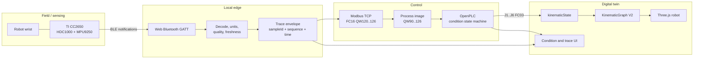

# Industrial Robot, PLC and IIoT Architecture Review

## Scope

This review evaluates the local robot condition-monitoring chain implemented by 3D Asset Forge V2. It covers sensing, edge acquisition, PLC decisions, Modbus transport, kinematic synchronization, traceability, visualization and security boundaries. It does not claim safety certification or replace the robot manufacturer's controller.

## Reference models

- ISO 23247-2 defines an entity and functional reference architecture for manufacturing digital twins.
- ISO 13373-1 covers repeatable vibration data acquisition, transducer selection and location, operating conditions, signal conditioning and continuous or periodic monitoring.
- OPC UA for Robotics models motion device systems, manipulators, axes, controllers, software and condition/runtime data.
- OPC UA for Machinery contributes identification, operation mode, counters, monitoring and notifications.
- IEC 62443 addresses cybersecurity processes and technical controls for industrial automation and control systems.
- ABB Ability Smart Sensor illustrates the industrial pattern sensor -> gateway -> analytics -> condition information -> maintenance action.
- Mature digital-twin platforms separate device ingestion, event processing, twin state, history and downstream routing.

## Comparative assessment

| Capability | Mature industrial pattern | Previous implementation | Current improvement | Remaining gap |
| --- | --- | --- | --- | --- |
| Asset model | Named machine, controller, axes and sensors | Robot plus loose registers | Robot, PLC and mounted IoT source shown as separate entities | OPC UA Robotics/Machinery semantic export |
| Acquisition | Timestamped engineering values with quality | Latest BLE axes only | Temperature, humidity, gyro magnitude, units and source | Calibrated industrial sensor and spectral vibration features |
| Edge processing | Filtering, validation and store-and-forward | Direct latest-value forwarding | Freshness, validity, sequence and bounded local history | Durable queue and offline replay |
| PLC control | Deterministic state machine and interlocks | Motion program driven by Command | NORMAL/WARNING/TRIP/STALE decision and safe Home response | Safety PLC and manufacturer-approved safe motion |
| Transport | Explicit contract, health and diagnostics | Ad-hoc register values | Versioned register map, FC03/FC06/FC16 and quality words | Authenticated/secured OT protocol gateway |
| Twin synchronization | Observed, desired and commanded state separated | Joint state reflected in 3D | Sensor input, PLC decision and kinematic output are visually distinct | Full desired/commanded/reported axis model |
| Traceability | Event identity, source, timestamps and lineage | Last value only | sampleId, sequence, source/receive time and previous sample link | Persistent historian, signatures and retention policy |
| Visualization | Overview, alarm context, trends and drill-down | Current values and raw registers | Compact condition strip with quality and trace identity | Trend charts, alarm acknowledgement and maintenance workflow |
| Security | Zones, conduits, identity, least privilege and audit | Loopback restrictions | Host allow-list and local-only defaults | Authentication, TLS, roles, signed configuration and security logging |

## Implemented reference architecture

## Telemetry contract

Each sample has two representations:

1. Engineering envelope used by the edge and UI: values, units, source, `sampleId`, monotonically increasing sequence, source timestamp, receive timestamp, quality and age.
2. Deterministic PLC process image: fixed-width integer words with documented scaling.

| Wire | Meaning | Encoding |
| ---: | --- | --- |
| 120 | Temperature | signed Celsius x100 |
| 121 | Relative humidity | %RH x100 |
| 122 | Gyroscope vector magnitude | degrees/second x100 |
| 123 | Sample age | milliseconds |
| 124 | Valid flag | 0/1 |
| 125 | Sequence | low 16 bits |
| 126 | Quality bits | bit0 valid, bit1 fresh, bit2 identified source |

The PLC never infers a healthy state from a numeric zero. A missing, invalid or stale sample is a distinct condition and causes a conservative response.

## Decision model

| State | Entry condition | Robot response | Operator meaning |
| --- | --- | --- | --- |
| NORMAL | Valid and below warning thresholds | Full programmed envelope | Production permitted |
| WARNING | Any warning threshold exceeded | 55% movement envelope | Inspect trend and mounting |
| TRIP | Any trip threshold exceeded | Home, automatic cycle inhibited | Diagnose condition before restart |
| STALE | Invalid quality or age >2500 ms | Home, automatic cycle inhibited | Restore acquisition path |

Thresholds in the example POU are demonstration values. A production commissioning process must collect baseline data by robot phase, payload, speed and tool, estimate normal distributions, define persistence/debounce and validate false-positive/false-negative rates.

## FMEA summary

| Failure mode | Detection | Current response | Production recommendation |
| --- | --- | --- | --- |
| BLE disconnect | age and valid flag | STALE -> Home | Redundant wired signal for critical control |
| Frozen sample | sequence and age | STALE -> Home | Heartbeat watchdog in PLC and gateway |
| Sensor detaches | abrupt gyro/orientation change | WARNING/TRIP | Mechanical retention and attachment inspection |
| Excess temperature | threshold | derate or Home | Validate against tool and robot ratings |
| Condensation/high RH | humidity threshold | derate or Home | Rated enclosure and dew-point analysis |
| Modbus interruption | poll error | twin marks offline | PLC-side comm watchdog and safe state |
| Malicious register write | not fully mitigated | loopback host restriction | Zones/conduits, authentication, allow-list and audit |
| Incorrect kinematic mapping | visual mismatch | regression tests | Commissioning sign-off per axis and pose |

## Security boundary

The current deployment is a laboratory architecture. Modbus TCP has no native authentication or encryption. It remains bound to loopback by default and must not be exposed directly to an untrusted network. A production deployment needs an OT zone, controlled conduit, authenticated gateway, role-based access, configuration integrity, audit records, backup/restore and patch/incident processes aligned with IEC 62443.

## Verification strategy

1. Unit-test scaling, signed conversion, quality bits and threshold boundaries.
2. Replay deterministic telemetry sequences through the controller endpoint.
3. Verify FC16 writes and FC03 reads against OpenPLC.
4. Confirm state transitions NORMAL -> WARNING -> TRIP -> STALE.
5. Confirm Home is stable and does not accumulate kinematic drift.
6. Compare source and receive timestamps and reject out-of-order samples.
7. Capture visual evidence showing sensor values, PLC decision and robot pose together.
8. Repeat with disconnected BLE, frozen sequence and malformed values.

## Roadmap

1. Add durable local historian and trend/alarm views.
2. Add configurable threshold profiles per robot, payload and operation phase.
3. Add OPC UA Robotics/Machinery semantic projection without replacing KinematicGraph V2.
4. Add authenticated edge identity, signed configuration and audit export.
5. Add industrial vibration features such as RMS, peak, crest factor and frequency bands using a sensor and sample rate suitable for condition monitoring.
6. Integrate manufacturer controller feedback and distinguish commanded, desired and measured axis positions.

## Primary references

- [ISO 23247-2 manufacturing digital twin reference architecture](https://www.iso.org/standard/78743.html)
- [ISO 13373-1 vibration condition-monitoring procedures](https://www.iso.org/standard/21831.html)
- [OPC UA for Robotics](https://reference.opcfoundation.org/specs/OPC-40010-1/1)
- [OPC UA for Machinery building blocks](https://reference.opcfoundation.org/specs/OPC-40001-1/1)
- [IEC 62443-4-1 secure development lifecycle](https://webstore.iec.ch/en/publication/33615)
- [ABB Ability Smart Sensor condition monitoring](https://library.e.abb.com/public/b21f130e733a4d74b2c471ba6477018f/9AKK106713A3853%20Product%20Note_ABB%20Ability%20Smart%20Sensor%20for%20motors_RevC_lowres.pdf)
- [Azure Digital Twins ingress, egress and history pattern](https://learn.microsoft.com/en-us/azure/digital-twins/concepts-data-ingress-egress)
