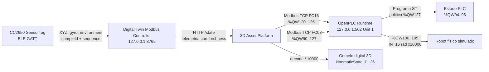

# Auditoria IoT -> Modbus -> OpenPLC -> Robot -> Gemelo digital

## Identificacion

| Campo | Valor |
| --- | --- |
| Inicio UTC | 2026-09-25T10:34:31.085Z |
| Fin UTC | 2026-09-25T10:35:16.562Z |
| IoT observado | CC2650 SensorTag |
| Controlador IoT | http://127.0.0.1:8765 |
| OpenPLC Modbus TCP | 127.0.0.1:502, Unit ID 1 |
| Periodo de muestreo nominal | 250 ms |
| Muestras totales / validas | 178 / 178 |
| Evidencia cruda | [iot-openplc-audit-2026-09-25T10-34-31-085Z.json](./iot-openplc-audit-2026-09-25T10-34-31-085Z.json) |
| Hash final SHA-256 | `4689499ab81f31198bb695623fde04b3cb2275af5b8b2b36800daa066d41f0af` |

## Arquitectura observada

## Mapa Modbus verificado

| Wire OpenPLC | HR convencional | Semantica | Codificacion |
| ---: | ---: | --- | --- |
| %QW90 | 40091 | Command | 0 Manual/Hold, 1 Auto, 2 Home |
| %QW91..93 | 40092..40094 | Status, paso y tiempo | UINT16 |
| %QW94..96 | 40095..40097 | AlarmCode, ConditionState, SpeedPermille | UINT16 |
| %QW100..105 | 40101..40106 | J1..J6 | INT16, rad x10000 |
| %QW120 | 40121 | Temperatura | INT16, grados C x100 |
| %QW121 | 40122 | Humedad | UINT16, %RH x100 |
| %QW122 | 40123 | Magnitud giroscopio | UINT16, grados/s x100 |
| %QW123..126 | 40124..40127 | Age, valid, sequence, quality bits | UINT16 |
| %QW127 | 40128 | SensorPolicy | 0 condition monitor, 1 motion permit |

Las direcciones de la columna HR usan notacion humana 40001-based. Las tramas utilizan direcciones wire 0-based. La captura ejecuta FC03 sobre wire 90 con 38 registros y conserva request/response hexadecimal y Transaction ID en el JSON.

## Resultados por fase

| Fase | n | IoT gyro min/media/max | PLC gyro min/media/max | ConditionState | AlarmCode | SpeedPermille |
| --- | ---: | --- | --- | --- | --- | --- |
| Quieto inicial | 59 | 0.50 / 1.00 / 1.36 | 1.46 / 1.46 / 1.46 | 2 | 5 | 0..0 |
| Movimiento manual | 78 | 0.74 / 1.01 / 1.28 | 1.46 / 1.46 / 1.46 | 2 | 5 | 0..0 |
| Quieto final | 40 | 0.74 / 1.03 / 1.29 | 1.46 / 1.46 / 1.46 | 2 | 5 | 0..0 |

## Evidencia representativa

| # | Fase | UTC | sampleId BLE | gyro IoT | %QW122 | age ms | state | alarm | speed | J1..J6 rad | Modbus TID |
| ---: | --- | --- | --- | ---: | ---: | ---: | ---: | ---: | ---: | --- | ---: |
| 1 | still-before | 2026-09-25T10:34:31.115Z | iot-mugtq7tt-wck | 1.04 | 1.46 | 18 | 2 | 5 | 0 | -1.571, -0.174, 1.833, 0.174, -0.785, -1.571 | 8000 |
| 10 | still-before | 2026-09-25T10:34:33.424Z | iot-mugtq9hk-wcs | 1.36 | 1.46 | 18 | 2 | 5 | 0 | -1.571, -0.174, 1.833, 0.174, -0.785, -1.571 | 3483 |
| 30 | still-before | 2026-09-25T10:34:38.544Z | iot-mugtqdfy-wdc | 0.95 | 1.46 | 18 | 2 | 5 | 0 | -1.571, -0.174, 1.833, 0.174, -0.785, -1.571 | 50552 |
| 59 | still-before | 2026-09-25T10:34:45.994Z | iot-mugtqj7d-we5 | 1.06 | 1.46 | 18 | 2 | 5 | 0 | -1.571, -0.174, 1.833, 0.174, -0.785, -1.571 | 31647 |
| 60 | movement | 2026-09-25T10:34:46.260Z | iot-mugtqjf8-we6 | 1.01 | 1.46 | 18 | 2 | 5 | 0 | -1.571, -0.174, 1.833, 0.174, -0.785, -1.571 | 26970 |
| 99 | movement | 2026-09-25T10:34:56.285Z | iot-mugtqr66-wf9 | 0.76 | 1.46 | 18 | 2 | 5 | 0 | -1.571, -0.174, 1.833, 0.174, -0.785, -1.571 | 48452 |
| 101 | movement | 2026-09-25T10:34:56.815Z | iot-mugtqrnl-wfb | 1.28 | 1.46 | 18 | 2 | 5 | 0 | -1.571, -0.174, 1.833, 0.174, -0.785, -1.571 | 8037 |
| 137 | movement | 2026-09-25T10:35:06.079Z | iot-mugtqyr2-wgc | 0.79 | 1.46 | 18 | 2 | 5 | 0 | -1.571, -0.174, 1.833, 0.174, -0.785, -1.571 | 3321 |
| 138 | still-after | 2026-09-25T10:35:06.345Z | iot-mugtqyy1-wgd | 0.97 | 1.46 | 18 | 2 | 5 | 0 | -1.571, -0.174, 1.833, 0.174, -0.785, -1.571 | 29854 |
| 150 | still-after | 2026-09-25T10:35:09.424Z | iot-mugtr1am-wgp | 1.29 | 1.46 | 18 | 2 | 5 | 0 | -1.571, -0.174, 1.833, 0.174, -0.785, -1.571 | 3185 |
| 158 | still-after | 2026-09-25T10:35:11.474Z | iot-mugtr2yo-wgx | 0.92 | 1.46 | 18 | 2 | 5 | 0 | -1.571, -0.174, 1.833, 0.174, -0.785, -1.571 | 14771 |
| 177 | still-after | 2026-09-25T10:35:16.310Z | iot-mugtr6q7-whf | 0.87 | 1.46 | 18 | 2 | 5 | 0 | -1.571, -0.174, 1.833, 0.174, -0.785, -1.571 | 28986 |

## Evaluacion causal

| Hipotesis verificable | Resultado | Evidencia |
| --- | --- | --- |
| El IoT entrega muestras trazables | PASS | sampleId, sequence, timestamps y quality incluidos por muestra |
| El movimiento supera el umbral de 3 grados/s | FAIL | pico IoT 1.28 grados/s |
| OpenPLC esta en Motion Permit | PASS | %QW127 observado: 1 |
| OpenPLC esta en Auto | PASS | %QW90 observado: 1 |
| Quietud produce HOLD por alarma 5 | PASS | ConditionState y AlarmCode de fases quietas |
| Joints PLC reaccionan | FAIL | cambios observados en %QW100..105 |
| Plataforma 3D consume el controlador | PASS | lector platform-3d observado en /state |
| Gemelo usa el mismo vector articular | PASS por contrato observado | kinematicState = signed(%QW100..105)/10000; valores conservados en cada muestra |

## Integridad y trazabilidad

Cada muestra incluye la trama Modbus TCP completa, valores crudos, decodificacion, identidad BLE y un hash SHA-256 encadenado con la muestra anterior. El hash final permite detectar cambios posteriores en la evidencia. El fichero JSON es la fuente primaria; este Markdown es su interpretacion.

## Limitaciones y anomalias

- **Anomalia ambiental detectada:** el CC2650 publico -40 C y 0 %RH. Esos valores son sentinelas/no plausibles y no deben usarse para decisiones industriales hasta corregir o calibrar el decoder GATT.
- La reaccion visual se audita mediante el lector vivo `platform-3d` y el vector exacto aplicado a `kinematicState`. Una medicion metrologica del render requeriria instrumentar matrices del canvas o captura de video sincronizada.
- Esta es una demostracion de laboratorio. No acredita seguridad funcional, SIL/PL, parada segura ni control de una maquina fisica.
