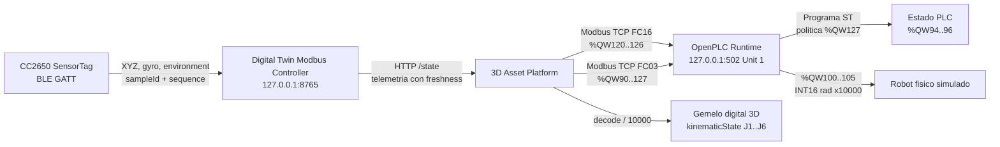

# Auditoria IoT -> Modbus -> OpenPLC -> Robot -> Gemelo digital

## Identificacion

| Campo | Valor |
| --- | --- |
| Inicio UTC | 2026-09-25T10:37:28.911Z |
| Fin UTC | 2026-09-25T10:38:19.188Z |
| IoT observado | CC2650 SensorTag |
| Controlador IoT | http://127.0.0.1:8765 |
| OpenPLC Modbus TCP | 127.0.0.1:502, Unit ID 1 |
| Periodo de muestreo nominal | 250 ms |
| Muestras totales / validas | 198 / 198 |
| Evidencia cruda | [iot-openplc-audit-2026-09-25T10-37-28-911Z.json](./iot-openplc-audit-2026-09-25T10-37-28-911Z.json) |
| Hash final SHA-256 | `d27e2cfb2e3cfdda15dc10725a22ca3afc0c9f5265482c62d1917ab5a6869554` |

## Arquitectura observada

## Mapa Modbus verificado

| Wire OpenPLC | HR convencional | Semantica | Codificacion |
| ---: | ---: | --- | --- |
| %QW90 | 40091 | Command | 0 Manual/Hold, 1 Auto, 2 Home |
| %QW91..93 | 40092..40094 | Status, paso y tiempo | UINT16 |
| %QW94..96 | 40095..40097 | AlarmCode, ConditionState, SpeedPermille | UINT16 |
| %QW100..105 | 40101..40106 | J1..J6 | INT16, rad x10000 |
| %QW120 | 40121 | Temperatura | INT16, grados C x100 |
| %QW121 | 40122 | Humedad | UINT16, %RH x100 |
| %QW122 | 40123 | Magnitud giroscopio | UINT16, grados/s x100 |
| %QW123..126 | 40124..40127 | Age, valid, sequence, quality bits | UINT16 |
| %QW127 | 40128 | SensorPolicy | 0 condition monitor, 1 motion permit |

Las direcciones de la columna HR usan notacion humana 40001-based. Las tramas utilizan direcciones wire 0-based. La captura ejecuta FC03 sobre wire 90 con 38 registros y conserva request/response hexadecimal y Transaction ID en el JSON.

## Resultados por fase

| Fase | n | IoT gyro min/media/max | PLC gyro min/media/max | ConditionState | AlarmCode | SpeedPermille |
| --- | ---: | --- | --- | --- | --- | --- |
| Quieto inicial | 59 | 0.72 / 1.02 / 1.43 | 0.72 / 1.02 / 1.43 | 2 | 5 | 0..0 |
| Movimiento manual | 99 | 0.63 / 1.00 / 1.34 | 0.63 / 1.00 / 1.34 | 2 | 5 | 0..0 |
| Quieto final | 39 | 0.71 / 1.08 / 1.28 | 0.71 / 1.07 / 1.28 | 2 | 5 | 0..0 |

## Evidencia representativa

| # | Fase | UTC | sampleId BLE | gyro IoT | %QW122 | age ms | state | alarm | speed | J1..J6 rad | TID FC16 / FC03 |
| ---: | --- | --- | --- | ---: | ---: | ---: | ---: | ---: | ---: | --- | ---: |
| 1 | still-before | 2026-09-25T10:37:28.967Z | iot-mugtu0zu-wve | 1.11 | 1.11 | 126 | 2 | 5 | 0 | -1.571, -0.174, 1.833, 0.174, -0.785, -1.571 | 56823 / 37467 |
| 29 | still-before | 2026-09-25T10:37:36.163Z | iot-mugtu6m3-ww7 | 1.43 | 1.43 | 40 | 2 | 5 | 0 | -1.571, -0.174, 1.833, 0.174, -0.785, -1.571 | 3069 / 6240 |
| 30 | still-before | 2026-09-25T10:37:36.427Z | iot-mugtu6tw-ww8 | 1.16 | 1.16 | 23 | 2 | 5 | 0 | -1.571, -0.174, 1.833, 0.174, -0.785, -1.571 | 60697 / 11507 |
| 59 | still-before | 2026-09-25T10:37:43.848Z | iot-mugtuces-wx1 | 1.00 | 1.00 | 213 | 2 | 5 | 0 | -1.571, -0.174, 1.833, 0.174, -0.785, -1.571 | 3721 / 51038 |
| 60 | movement | 2026-09-25T10:37:44.108Z | iot-mugtucm2-wx2 | 1.01 | 1.01 | 211 | 2 | 5 | 0 | -1.571, -0.174, 1.833, 0.174, -0.785, -1.571 | 43564 / 37013 |
| 109 | movement | 2026-09-25T10:37:56.507Z | iot-mugtum9o-wyf | 0.82 | 0.82 | 96 | 2 | 5 | 0 | -1.571, -0.174, 1.833, 0.174, -0.785, -1.571 | 41915 / 26252 |
| 153 | movement | 2026-09-25T10:38:07.627Z | iot-mugtuuuf-wzp | 1.34 | 1.34 | 101 | 2 | 5 | 0 | -1.571, -0.174, 1.833, 0.174, -0.785, -1.571 | 6261 / 28967 |
| 158 | movement | 2026-09-25T10:38:08.897Z | iot-mugtuvu0-wzu | 0.75 | 0.75 | 91 | 2 | 5 | 0 | -1.571, -0.174, 1.833, 0.174, -0.785, -1.571 | 47317 / 60893 |
| 159 | still-after | 2026-09-25T10:38:09.147Z | iot-mugtuw00-wzv | 1.12 | 1.12 | 125 | 2 | 5 | 0 | -1.571, -0.174, 1.833, 0.174, -0.785, -1.571 | 21695 / 37678 |
| 173 | still-after | 2026-09-25T10:38:12.697Z | iot-mugtuyt1-x0a | 1.28 | 1.28 | 37 | 2 | 5 | 0 | -1.571, -0.174, 1.833, 0.174, -0.785, -1.571 | 28000 / 65358 |
| 178 | still-after | 2026-09-25T10:38:13.978Z | iot-mugtuzn2-x0f | 1.09 | 1.09 | 237 | 2 | 5 | 0 | -1.571, -0.174, 1.833, 0.174, -0.785, -1.571 | 38856 / 36387 |
| 197 | still-after | 2026-09-25T10:38:18.922Z | iot-mugtv3kw-x0z | 1.20 | 1.20 | 79 | 2 | 5 | 0 | -1.571, -0.174, 1.833, 0.174, -0.785, -1.571 | 13781 / 5070 |

## Evaluacion causal

| Hipotesis verificable | Resultado | Evidencia |
| --- | --- | --- |
| El IoT entrega muestras trazables | PASS | sampleId, sequence, timestamps y quality incluidos por muestra |
| El movimiento supera el umbral de 3 grados/s | FAIL | pico IoT 1.34 grados/s |
| OpenPLC esta en Motion Permit | PASS | %QW127 observado: 1 |
| OpenPLC esta en Auto | PASS | %QW90 observado: 1 |
| Quietud produce HOLD por alarma 5 | PASS | ConditionState y AlarmCode de fases quietas |
| Joints PLC reaccionan | FAIL | cambios observados en %QW100..105 |
| Plataforma 3D consume el controlador | PASS | lector platform-3d observado en /state |
| Gemelo usa el mismo vector articular | PASS por contrato observado | kinematicState = signed(%QW100..105)/10000; valores conservados en cada muestra |

## Integridad y trazabilidad

Cada muestra incluye la trama Modbus TCP FC16 de escritura, la trama FC03 de lectura, valores crudos, decodificacion, identidad BLE y un hash SHA-256 encadenado con la muestra anterior. El hash final permite detectar cambios posteriores en la evidencia. El fichero JSON es la fuente primaria; este Markdown es su interpretacion.

## Limitaciones y anomalias

- **Anomalia ambiental detectada:** el CC2650 publico -40 C y 0 %RH. Esos valores son sentinelas/no plausibles y no deben usarse para decisiones industriales hasta corregir o calibrar el decoder GATT.
- La reaccion visual se audita mediante el lector vivo `platform-3d` y el vector exacto aplicado a `kinematicState`. Una medicion metrologica del render requeriria instrumentar matrices del canvas o captura de video sincronizada.
- Esta es una demostracion de laboratorio. No acredita seguridad funcional, SIL/PL, parada segura ni control de una maquina fisica.
