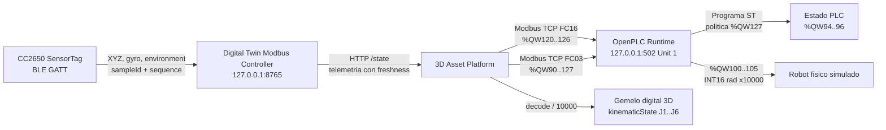

# Auditoria IoT -> Modbus -> OpenPLC -> Robot -> Gemelo digital

## Identificacion

| Campo | Valor |
| --- | --- |
| Inicio UTC | 2026-09-25T10:40:45.753Z |
| Fin UTC | 2026-09-25T10:41:41.007Z |
| IoT observado | CC2650 SensorTag |
| Controlador IoT | http://127.0.0.1:8765 |
| OpenPLC Modbus TCP | 127.0.0.1:502, Unit ID 1 |
| Periodo de muestreo nominal | 200 ms |
| Muestras totales / validas | 269 / 269 |
| Evidencia cruda | [iot-openplc-audit-2026-09-25T10-40-45-753Z.json](./iot-openplc-audit-2026-09-25T10-40-45-753Z.json) |
| Hash final SHA-256 | `2273a3e7c32147c411916a25cd3cd165bb2fc80129262ddca8a3dfe27be5cbf1` |

## Arquitectura observada

## Mapa Modbus verificado

| Wire OpenPLC | HR convencional | Semantica | Codificacion |
| ---: | ---: | --- | --- |
| %QW90 | 40091 | Command | 0 Manual/Hold, 1 Auto, 2 Home |
| %QW91..93 | 40092..40094 | Status, paso y tiempo | UINT16 |
| %QW94..96 | 40095..40097 | AlarmCode, ConditionState, SpeedPermille | UINT16 |
| %QW100..105 | 40101..40106 | J1..J6 | INT16, rad x10000 |
| %QW120 | 40121 | Temperatura | INT16, grados C x100 |
| %QW121 | 40122 | Humedad | UINT16, %RH x100 |
| %QW122 | 40123 | Magnitud giroscopio | UINT16, grados/s x100 |
| %QW123..126 | 40124..40127 | Age, valid, sequence, quality bits | UINT16 |
| %QW127 | 40128 | SensorPolicy | 0 condition monitor, 1 motion permit |

Las direcciones de la columna HR usan notacion humana 40001-based. Las tramas utilizan direcciones wire 0-based. La captura ejecuta FC03 sobre wire 90 con 38 registros y conserva request/response hexadecimal y Transaction ID en el JSON.

## Resultados por fase

| Fase | n | IoT gyro min/media/max | PLC gyro min/media/max | ConditionState | AlarmCode | SpeedPermille |
| --- | ---: | --- | --- | --- | --- | --- |
| Quieto inicial | 73 | 0.72 / 0.96 / 1.21 | 0.72 / 0.96 / 1.21 | 2 | 5 | 0..0 |
| Movimiento manual | 146 | 0.69 / 0.97 / 1.24 | 0.69 / 0.97 / 1.24 | 2 | 5 | 0..0 |
| Quieto final | 49 | 0.62 / 0.96 / 1.20 | 0.62 / 0.96 / 1.20 | 2 | 5 | 0..0 |

## Evidencia representativa

| # | Fase | UTC | sampleId BLE | gyro IoT | %QW122 | age ms | state | alarm | speed | J1..J6 rad | TID FC16 / FC03 |
| ---: | --- | --- | --- | ---: | ---: | ---: | ---: | ---: | ---: | --- | ---: |
| 1 | still-before | 2026-09-25T10:40:45.815Z | iot-mugty8xv-xh2 | 1.00 | 1.00 | 53 | 2 | 5 | 0 | -1.571, -0.174, 1.833, 0.174, -0.785, -1.571 | 35095 / 20206 |
| 37 | still-before | 2026-09-25T10:40:53.239Z | iot-mugtyejf-xhw | 1.00 | 1.00 | 219 | 2 | 5 | 0 | -1.571, -0.174, 1.833, 0.174, -0.785, -1.571 | 39032 / 50583 |
| 57 | still-before | 2026-09-25T10:40:57.361Z | iot-mugtyhsl-xid | 1.21 | 1.21 | 123 | 2 | 5 | 0 | -1.571, -0.174, 1.833, 0.174, -0.785, -1.571 | 12085 / 30755 |
| 73 | still-before | 2026-09-25T10:41:00.646Z | iot-mugtykbx-xiq | 0.93 | 0.93 | 121 | 2 | 5 | 0 | -1.571, -0.174, 1.833, 0.174, -0.785, -1.571 | 6445 / 32192 |
| 74 | movement | 2026-09-25T10:41:00.863Z | iot-mugtyki1-xir | 0.85 | 0.85 | 118 | 2 | 5 | 0 | -1.571, -0.174, 1.833, 0.174, -0.785, -1.571 | 31699 / 45705 |
| 147 | movement | 2026-09-25T10:41:15.906Z | iot-mugtyw4v-xke | 1.06 | 1.06 | 83 | 2 | 5 | 0 | -1.571, -0.174, 1.833, 0.174, -0.785, -1.571 | 62726 / 28838 |
| 202 | movement | 2026-09-25T10:41:27.186Z | iot-mugtz4s4-xlm | 1.24 | 1.24 | 157 | 2 | 5 | 0 | -1.571, -0.174, 1.833, 0.174, -0.785, -1.571 | 45324 / 51982 |
| 219 | movement | 2026-09-25T10:41:30.684Z | iot-mugtz7ju-xm0 | 1.16 | 1.16 | 66 | 2 | 5 | 0 | -1.571, -0.174, 1.833, 0.174, -0.785, -1.571 | 1865 / 34295 |
| 220 | still-after | 2026-09-25T10:41:30.892Z | iot-mugtz7ju-xm0 | 1.16 | 1.16 | 274 | 2 | 5 | 0 | -1.571, -0.174, 1.833, 0.174, -0.785, -1.571 | 17894 / 59065 |
| 235 | still-after | 2026-09-25T10:41:33.976Z | iot-mugtza3o-xmb | 1.20 | 1.20 | 52 | 2 | 5 | 0 | -1.571, -0.174, 1.833, 0.174, -0.785, -1.571 | 63236 / 18330 |
| 244 | still-after | 2026-09-25T10:41:35.857Z | iot-mugtzbgc-xmh | 0.96 | 0.96 | 181 | 2 | 5 | 0 | -1.571, -0.174, 1.833, 0.174, -0.785, -1.571 | 29659 / 20447 |
| 268 | still-after | 2026-09-25T10:41:40.806Z | iot-mugtzfef-xn1 | 1.04 | 1.04 | 14 | 2 | 5 | 0 | -1.571, -0.174, 1.833, 0.174, -0.785, -1.571 | 46353 / 4097 |

## Evaluacion causal

| Hipotesis verificable | Resultado | Evidencia |
| --- | --- | --- |
| El IoT entrega muestras trazables | PASS | sampleId, sequence, timestamps y quality incluidos por muestra |
| El movimiento supera el umbral de 3 grados/s | FAIL | pico IoT 1.24 grados/s |
| OpenPLC esta en Motion Permit | PASS | %QW127 observado: 1 |
| OpenPLC esta en Auto | PASS | %QW90 observado: 1 |
| Quietud produce HOLD por alarma 5 | PASS | ConditionState y AlarmCode de fases quietas |
| Joints PLC reaccionan | FAIL | cambios observados en %QW100..105 |
| Plataforma 3D consume el controlador | PASS | lector platform-3d observado en /state |
| Gemelo usa el mismo vector articular | PASS por contrato observado | kinematicState = signed(%QW100..105)/10000; valores conservados en cada muestra |

## Integridad y trazabilidad

Cada muestra incluye la trama Modbus TCP FC16 de escritura, la trama FC03 de lectura, valores crudos, decodificacion, identidad BLE y un hash SHA-256 encadenado con la muestra anterior. El hash final permite detectar cambios posteriores en la evidencia. El fichero JSON es la fuente primaria; este Markdown es su interpretacion.

## Limitaciones y anomalias

- **Anomalia ambiental detectada:** el CC2650 publico -40 C y 0 %RH. Esos valores son sentinelas/no plausibles y no deben usarse para decisiones industriales hasta corregir o calibrar el decoder GATT.
- La reaccion visual se audita mediante el lector vivo `platform-3d` y el vector exacto aplicado a `kinematicState`. Una medicion metrologica del render requeriria instrumentar matrices del canvas o captura de video sincronizada.
- Esta es una demostracion de laboratorio. No acredita seguridad funcional, SIL/PL, parada segura ni control de una maquina fisica.
