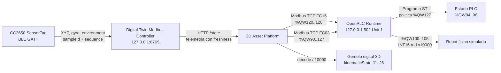

# Auditoria IoT -> Modbus -> OpenPLC -> Robot -> Gemelo digital

## Identificacion

| Campo | Valor |
| --- | --- |
| Inicio UTC | 2026-09-25T10:49:04.375Z |
| Fin UTC | 2026-09-25T10:49:47.844Z |
| IoT observado | CC2650 SensorTag |
| Controlador IoT | http://127.0.0.1:8765 |
| OpenPLC Modbus TCP | 127.0.0.1:502, Unit ID 1 |
| Periodo de muestreo nominal | 200 ms |
| Muestras totales / validas | 212 / 212 |
| Evidencia cruda | [iot-openplc-audit-2026-09-25T10-49-04-375Z.json](./iot-openplc-audit-2026-09-25T10-49-04-375Z.json) |
| Hash final SHA-256 | `3ba1e035bed62b14346f428fa0bddccd2ef1ab08e7e16f2ead4f71c6885f6ab8` |

## Arquitectura observada

## Mapa Modbus verificado

| Wire OpenPLC | HR convencional | Semantica | Codificacion |
| ---: | ---: | --- | --- |
| %QW90 | 40091 | Command | 0 Manual/Hold, 1 Auto, 2 Home |
| %QW91..93 | 40092..40094 | Status, paso y tiempo | UINT16 |
| %QW94..96 | 40095..40097 | AlarmCode, ConditionState, SpeedPermille | UINT16 |
| %QW100..105 | 40101..40106 | J1..J6 | INT16, rad x10000 |
| %QW120 | 40121 | Temperatura | INT16, grados C x100 |
| %QW121 | 40122 | Humedad | UINT16, %RH x100 |
| %QW122 | 40123 | Magnitud giroscopio | UINT16, grados/s x100 |
| %QW123..126 | 40124..40127 | Age, valid, sequence, quality bits | UINT16 |
| %QW127 | 40128 | SensorPolicy | 0 condition monitor, 1 motion permit |

Las direcciones de la columna HR usan notacion humana 40001-based. Las tramas utilizan direcciones wire 0-based. La captura ejecuta FC03 sobre wire 90 con 38 registros y conserva request/response hexadecimal y Transaction ID en el JSON.

## Resultados por fase

| Fase | n | IoT gyro min/media/max | PLC gyro min/media/max | ConditionState | AlarmCode | SpeedPermille |
| --- | ---: | --- | --- | --- | --- | --- |
| Quieto inicial | 15 | 173.21 / 305.45 / 415.82 | 173.21 / 305.45 / 415.82 | 2, 1 | 3, 0 | 0..550 |
| Movimiento manual | 147 | 51.73 / 242.16 / 433.00 | 51.73 / 242.16 / 433.00 | 1, 2, 0 | 0, 3 | 0..1000 |
| Quieto final | 49 | 107.19 / 276.87 / 433.00 | 107.19 / 276.87 / 433.00 | 2, 1, 0 | 3, 0 | 0..1000 |

## Evidencia representativa

| # | Fase | UTC | sampleId BLE | gyro IoT | %QW122 | age ms | state | alarm | speed | J1..J6 rad | TID FC16 / FC03 |
| ---: | --- | --- | --- | ---: | ---: | ---: | ---: | ---: | ---: | --- | ---: |
| 1 | still-before | 2026-09-25T10:49:04.439Z | iot-mugu8xiu-yyj | 353.91 | 353.91 | 259 | 2 | 3 | 0 | -1.571, -0.174, 1.833, 0.174, -0.785, -1.571 | 35487 / 24482 |
| 2 | still-before | 2026-09-25T10:49:04.646Z | iot-mugu8xqj-yyk | 415.82 | 415.82 | 189 | 2 | 3 | 0 | -1.571, -0.174, 1.833, 0.174, -0.785, -1.571 | 17044 / 59680 |
| 8 | still-before | 2026-09-25T10:49:05.873Z | iot-mugu8ytt-yyp | 173.21 | 173.21 | 2 | 1 | 0 | 550 | -1.571, -0.174, 1.833, 0.174, -0.785, -1.571 | 60448 / 46498 |
| 15 | still-before | 2026-09-25T10:49:07.316Z | iot-mugu8zrk-yyu | 263.03 | 263.03 | 229 | 2 | 3 | 0 | -1.521, -0.188, 1.816, 0.197, -0.761, -1.521 | 14532 / 27715 |
| 16 | movement | 2026-09-25T10:49:07.523Z | iot-mugu8zzg-yyv | 208.34 | 208.34 | 153 | 1 | 0 | 550 | -1.521, -0.188, 1.816, 0.197, -0.761, -1.521 | 1836 / 39631 |
| 67 | movement | 2026-09-25T10:49:17.989Z | iot-mugu986c-z00 | 433.00 | 433.00 | 3 | 2 | 3 | 0 | -0.869, -0.370, 1.599, 0.487, -0.434, -0.869 | 46659 / 32869 |
| 89 | movement | 2026-09-25T10:49:22.504Z | iot-mugu9bjj-z0h | 202.94 | 202.94 | 155 | 2 | 3 | 0 | -1.070, -0.314, 1.666, 0.397, -0.535, -1.070 | 43306 / 1881 |
| 162 | movement | 2026-09-25T10:49:37.471Z | iot-mugu9n06-z23 | 358.99 | 358.99 | 266 | 2 | 3 | 0 | -0.864, -0.371, 1.597, 0.488, -0.432, -0.864 | 34888 / 7183 |
| 163 | still-after | 2026-09-25T10:49:37.681Z | iot-mugu9n81-z24 | 433.00 | 433.00 | 194 | 2 | 3 | 0 | -0.864, -0.371, 1.597, 0.488, -0.432, -0.864 | 6781 / 6256 |
| 187 | still-after | 2026-09-25T10:49:42.668Z | iot-mugu9r24-z2n | 219.60 | 219.60 | 210 | 1 | 0 | 550 | -0.864, -0.371, 1.597, 0.489, -0.432, -0.864 | 50090 / 44731 |
| 211 | still-after | 2026-09-25T10:49:47.634Z | iot-mugu9uvx-z37 | 130.01 | 130.01 | 215 | 1 | 0 | 550 | -0.866, -0.370, 1.598, 0.488, -0.433, -0.866 | 12806 / 22503 |

## Evaluacion causal

| Hipotesis verificable | Resultado | Evidencia |
| --- | --- | --- |
| El IoT entrega muestras trazables | PASS | sampleId, sequence, timestamps y quality incluidos por muestra |
| El movimiento supera el umbral de 3 grados/s | PASS | pico IoT 433.00 grados/s |
| OpenPLC esta en Motion Permit | PASS | %QW127 observado: 1 |
| OpenPLC esta en Auto | PASS | %QW90 observado: 1 |
| Quietud produce HOLD por alarma 5 | FAIL | ConditionState y AlarmCode de fases quietas |
| Joints PLC reaccionan | PASS | cambios observados en %QW100..105 |
| Plataforma 3D consume el controlador | PASS | lector platform-3d observado en /state |
| Gemelo usa el mismo vector articular | PASS por contrato observado | kinematicState = signed(%QW100..105)/10000; valores conservados en cada muestra |

## Integridad y trazabilidad

Cada muestra incluye la trama Modbus TCP FC16 de escritura, la trama FC03 de lectura, valores crudos, decodificacion, identidad BLE y un hash SHA-256 encadenado con la muestra anterior. El hash final permite detectar cambios posteriores en la evidencia. El fichero JSON es la fuente primaria; este Markdown es su interpretacion.

## Limitaciones y anomalias

- **Anomalia ambiental detectada:** el CC2650 publico -40 C y 0 %RH. Esos valores son sentinelas/no plausibles y no deben usarse para decisiones industriales hasta corregir o calibrar el decoder GATT.
- La reaccion visual se audita mediante el lector vivo `platform-3d` y el vector exacto aplicado a `kinematicState`. Una medicion metrologica del render requeriria instrumentar matrices del canvas o captura de video sincronizada.
- Esta es una demostracion de laboratorio. No acredita seguridad funcional, SIL/PL, parada segura ni control de una maquina fisica.
